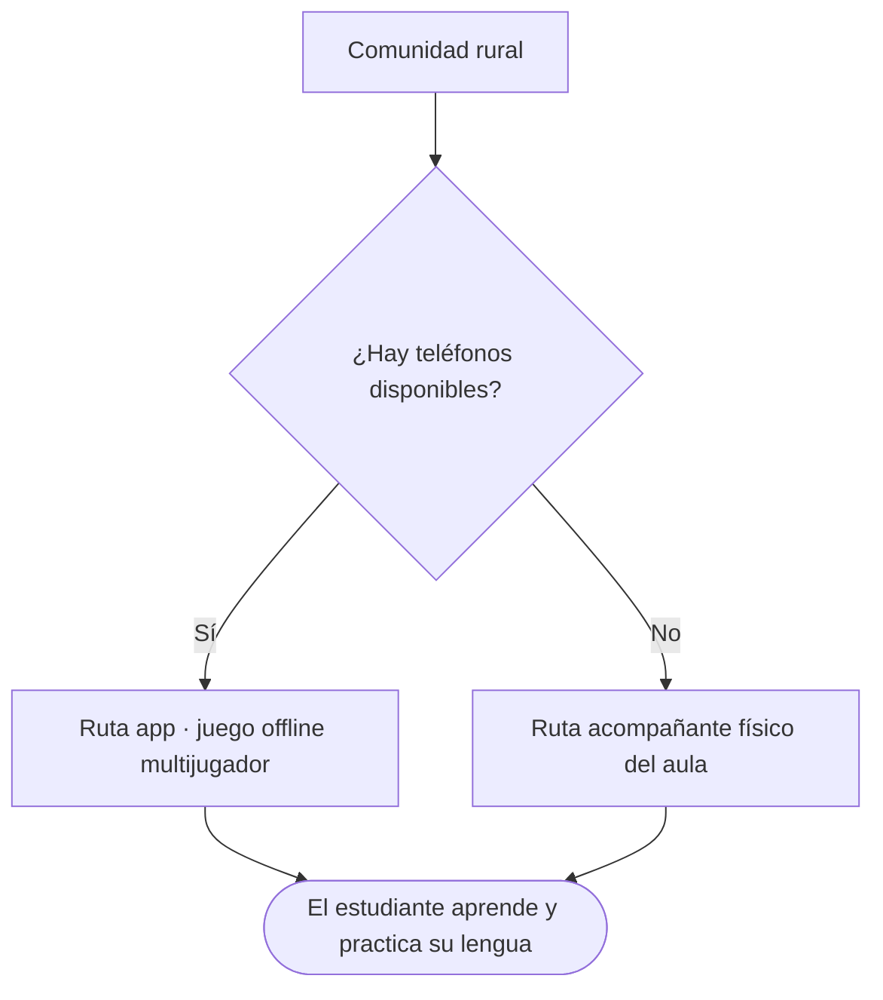
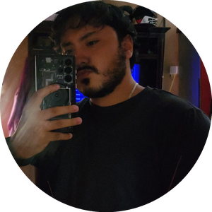
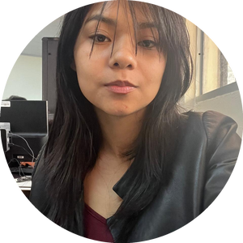
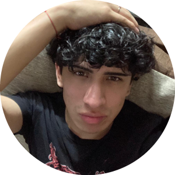

  

 

  

  

 

&nbsp;&nbsp;
<a href="#el-problema">El problema</a>&nbsp;&nbsp;·&nbsp;&nbsp;
<a href="#cómo-entendimos-el-reto">Cómo entendimos el reto</a>&nbsp;&nbsp;·&nbsp;&nbsp;
<a href="#nuestra-solución-dos-rutas-un-mismo-destino">Nuestra solución</a>&nbsp;&nbsp;·&nbsp;&nbsp;
<a href="#cómo-funciona">Cómo funciona</a>&nbsp;&nbsp;·&nbsp;&nbsp;
<a href="#identidad">Identidad</a>&nbsp;&nbsp;·&nbsp;&nbsp;
<a href="#roadmap">Roadmap</a>&nbsp;&nbsp;·&nbsp;&nbsp;
<a href="#equipo">Equipo</a>

 

---

<h2 id="el-problema">

&nbsp;El problema
</h2>

En las comunidades rurales de Nicaragua se hablan lenguas que llevan siglos aquí — **Miskito, Mayangna, Rama y Garífuna**. Y se están perdiendo, generación tras generación.

No porque a nadie le importen, sino porque enseñarlas de verdad choca con tres barreras al mismo tiempo:

|  Conectividad |  Dispositivos |  Tiempo del maestro |
|:---:|:---:|:---:|
| Casi nula o intermitente en las zonas rurales | Desigual: algunas comunidades tienen teléfonos, otras casi ninguno | Un solo maestro para un aula numerosa, sin poder atender a cada estudiante |

Piko enseña **Miskito, Mayangna, Rama, Garífuna e inglés**, todos con la misma mecánica de aprendizaje — la identidad de una comunidad y las puertas que se abren hacia afuera no tienen por qué enseñarse por separado.

 

<h2 id="cómo-entendimos-el-reto">

&nbsp;Cómo entendimos el reto
</h2>

El error más fácil habría sido diseñar **una sola solución** y asumir que sirve para todas las comunidades por igual.

Entendimos que **el problema no es uno solo — son varios problemas distintos, según cada comunidad.** Por eso Piko no se pregunta *"¿cómo enseñamos una lengua?"*, sino *"¿cómo enseñamos una lengua en **este** contexto específico, con lo que **esta** comunidad realmente tiene?"*

 

<h2 id="nuestra-solución-dos-rutas-un-mismo-destino">

&nbsp;Nuestra solución: dos rutas, un mismo destino
</h2>

<table>
<tr>
<td width="50%" valign="top">

<h3>&nbsp; Ruta 1 — Aula con teléfonos</h3>

- Aprendizaje tipo juego, controlado por el maestro
- Multijugador **local**, sin depender de internet
- Ejercicios de escucha, traducción y construcción de oraciones
- El maestro elige tema y dificultad desde presets guardados

</td>
<td width="50%" valign="top">

<h3>&nbsp; Ruta 2 — Aula sin suficientes teléfonos</h3>

- Un acompañante físico que solo necesita corriente eléctrica
- Organiza a los estudiantes en grupos de trabajo
- Evalúa la pronunciación de un representante por grupo
- Sigue funcionando aunque se pierda la conexión a mitad de sesión

</td>
</tr>
</table>

Dos caminos distintos. **El mismo destino: que estas lenguas sigan vivas.**

 

 

<h2 id="cómo-funciona">

&nbsp;Cómo funciona
</h2>

**Multijugador local:** el teléfono del profesor actúa como anfitrión de la partida en cuanto activa el hotspot, y los teléfonos de los estudiantes se conectan a él. Es una topología simple en estrella — el profesor es el único punto central, los estudiantes nunca se comunican directamente entre sí. Elegimos este enfoque en vez de una conexión punto a punto porque, al estar todos dentro de la misma red local, no hace falta la complejidad de establecer conexiones directas entre dispositivos.

**Sincronización diferencial:** cada vez que cambia el progreso de un estudiante, solo se envía lo nuevo — nunca todo el historial de nuevo. Así, si un estudiante se desconecta y vuelve a entrar, retoma justo donde quedó sin gastar tiempo ni datos de más.

**Principio de diseño, de fondo:**
- **Offline-first**: nada depende de tener internet estable.
- **El progreso es del estudiante, no del dispositivo**: puede cambiar de teléfono sin perder nada.

 

**El robot** se construye sobre Arduino, que controla el cuerpo y los sensores, mientras una pequeña computadora en el aula se encarga del procesamiento más pesado — es más económico tener una sola por aula que un dispositivo potente por estudiante.

**Formación de grupos:** el robot arma los grupos combinando estudiantes de distintos niveles (peer teaching) y los rota entre sesiones, para que el más avanzado de cada grupo refuerce lo aprendido enseñando a los demás, y nadie trabaje siempre con las mismas personas.

**Evaluación de pronunciación:** cada grupo manda a un representante a hablar con el robot, que corre un modelo de reconocimiento de voz liviano en la computadora del aula. No intenta entender oraciones completas — detecta si el estudiante dijo las palabras clave esperadas y con qué claridad, que es justo lo necesario para dar una retroalimentación útil sin exigir un modelo pesado.

**Configuración y conexión:** el profesor arma la sesión desde la app y se la envía al robot por la misma red WiFi del hotspot. El robot guarda esa configuración, así que si la conexión se corta a mitad de clase, sigue funcionando con los últimos datos que recibió.

 

<h2 id="identidad">

&nbsp;Identidad
</h2>

<i>Esta identidad visual todavía está en fase de diseño — lo que sigue es la dirección que estamos construyendo.</i>

Elegimos una paleta **verde y azulada** porque representa a nuestra patria: sus extensos bosques y sus cielos azules. No es una decisión solo estética — es un énfasis deliberado en que esta es una solución pensada para **zonas rurales**, el mismo territorio que esos colores evocan.

La mascota se llama **Piko**, y también le da nombre a la app. Piko es un chocoyito — un loro pequeño que le encanta hablar y repetir todo lo que escucha, con énfasis en el lenguaje, igual que queremos que las nuevas generaciones repitan estas lenguas. Es un animal que se puede ver a lo largo de toda Nicaragua, tanto como mascota en los hogares como en su hábitat natural, especialmente en las zonas rurales del país — el mismo lugar donde Piko busca llegar.

| Elemento | Piko |
|---|---|
|  Mascota | Piko, un chocoyito — repite lo que escucha, igual que queremos que las nuevas generaciones repitan estas lenguas |
|  Paleta | Verde · Azul — bosques y cielos de Nicaragua |
|  Meta de entrega | HN10 · 28 de octubre de 2026 |

 

<h2 id="roadmap">

&nbsp;Roadmap
</h2>

- [x] Definición del reto y las dos rutas de solución
- [x] Guion y producción del video de presentación
- [ ] Prototipo funcional para la demo de HN10
- [ ] Alianza con MINED para pilotos educativos
- [ ] Piloto en comunidad real
- [ ] *Visión futura:* diálogo generado y respuestas del robot vía un LLM liviano con RAG, alimentado con diccionarios y literatura de las lenguas en peligro e inglés

 

 

<h2 id="equipo">

&nbsp;Equipo
</h2>

**MugiWare** — construido con cariño desde Jinotega, Nicaragua

  

<table> <tr> <td align="center" valign="top" width="20%">   <b>Danilo Herrera</b>  Desarrollo </td> <td align="center" valign="top" width="20%">   <b>Scarleth Blandon</b>  Diseño </td> <td align="center" valign="top" width="20%">   <b>Erling Arauz</b>  Diseño </td> <td align="center" valign="top" width="20%">   <b>Ruby Perez</b>  Comunicación </td> <td align="center" valign="top" width="20%">   <b>Humberto Gutierrez</b>  Marketing </td> </tr> </table> 
  

 

