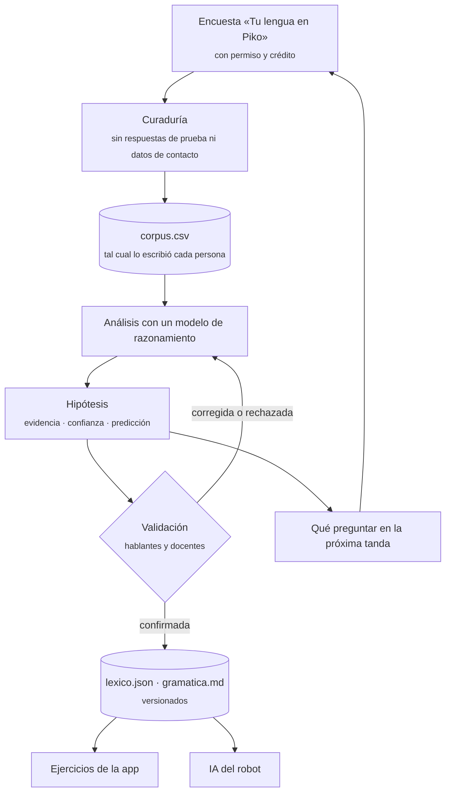

# Metodología: descubrimiento asistido de gramática en lenguas con documentación escasa

> Cómo Piko construye diccionarios y gramáticas del miskito, el mayangna, el
> rama y el garífuna. Usa modelos de lenguaje de razonamiento avanzado para
> detectar patrones, y la validación de hablantes nativos para decidir qué es
> correcto.

---

## Resumen

Piko enseña lenguas indígenas y afrodescendientes de la Costa Caribe de
Nicaragua, que tienen muy poca documentación a mano. Hay palabras sueltas en
libros difíciles de conseguir y casi nada sobre las variantes de cada
comunidad. Para enseñarlas, y para que el robot de aula pueda escucharlas y
hablar de ellas, hace falta algo más que una lista de traducciones: saber
**cómo funciona la lengua**. Es decir, cómo se forman sus palabras, en qué
orden van y qué distinciones hace que el español no hace.

Este documento describe el método con que se obtiene ese conocimiento a partir
de datos escasos:

1. Se recogen datos con consentimiento explícito, en la encuesta *Tu lengua en
   Piko*.
2. Se conservan tal cual los escribió cada persona, en un corpus trazable.
3. Se analizan con modelos de lenguaje de razonamiento, que proponen reglas
   fonológicas, morfológicas y sintácticas.
4. Cada regla queda como una **hipótesis falsable**, con su evidencia, un
   nivel de confianza y una predicción comprobable.
5. Las reglas se validan con hablantes nativos y se ponen a prueba con cada
   tanda nueva de datos.

Lo validado alimenta los ejercicios de la aplicación y la inteligencia
artificial del robot.

El principio que ordena todo el proceso cabe en una línea: **el modelo
propone, la comunidad decide.**

---

## 1. El problema

El miskito (*Miskitu*, ISO 639-3 `miq`) pertenece a la familia misumalpa y se
habla en la Costa Caribe de Nicaragua y en La Mosquitia hondureña. Tiene más de
cien mil hablantes. Hay descripciones desde principios del siglo XX
(Conzemius 1929), un diccionario bilingüe (Heath y Marx 1953) y trabajos
gramaticales académicos (Salamanca 1988; Hale 1991; Hale y Salamanca 2001). Son
pocos, difíciles de conseguir en una escuela rural, y no registran cómo se
habla hoy en cada comunidad. Para el mayangna, el rama y el garífuna la
situación es parecida o peor. El rama, en particular, está en peligro crítico.

Las herramientas habituales del procesamiento del lenguaje (traducción
automática, analizadores morfológicos, reconocimiento de voz) se entrenan con
cientos de miles o millones de oraciones. Piko parte de decenas. Es un régimen
de datos **extremadamente escasos**, en el que esas herramientas no se pueden
entrenar.

Lo que sí existe son hablantes dispuestos a enseñar su lengua. Y existe un
tipo de análisis que un lingüista de campo hace a mano: mirar un puñado de
frases traducidas y deducir las reglas. Ese trabajo es lento y caro, y en
estas lenguas casi nadie lo está haciendo. El método de este documento usa
modelos de razonamiento para hacer ese análisis al ritmo en que llegan los
datos, y deja en manos de hablantes la decisión sobre qué es correcto.

---

## 2. Principios

Estos seis principios no se negocian.

**2.1 La lengua pertenece a su comunidad.** Las decisiones sobre qué forma es
correcta, cómo se escribe y cómo se pronuncia las toman hablantes y docentes de
educación intercultural bilingüe, no el equipo ni el modelo. Si dos
comunidades lo dicen distinto, las dos formas se registran como variantes, no
como errores.

**2.2 El modelo propone, las personas deciden.** Todo lo que produce un modelo
de lenguaje es una hipótesis hasta que un hablante la valida.

**2.3 Nada inventado llega a un estudiante.** Toda palabra que ve un niño en un
ejercicio se puede rastrear hasta lo que escribió una persona, incluidas las
opciones incorrectas. Las predicciones del modelo sirven para decidir qué
preguntar y nunca se muestran en una lección. Esto no queda en una promesa:
`herramientas/verificar.ts` lo comprueba en cada cambio (sección 4.7).

**2.4 El registro original no se toca.** Lo que escribió cada persona se
guarda tal cual, con sus mayúsculas, sus variantes y sus errores de tipeo.
Cualquier normalización vive en una capa aparte y dice qué cambió y por qué.

**2.5 Toda afirmación muestra su evidencia.** Cada regla lleva los ejemplos que
la sostienen, los que la contradicen y su nivel de confianza.

**2.6 Consentimiento y privacidad.** Sólo se usa lo que tiene permiso
explícito. El crédito es el que eligió cada persona: con su nombre, con el de
su comunidad o de forma anónima. Los datos de contacto nunca entran al
repositorio.

---

## 3. Por qué modelos de razonamiento

### Qué son

Son modelos de lenguaje grandes que, antes de responder, producen una cadena
explícita de razonamiento intermedio (Wei et al. 2022). Los modelos más
recientes lo hacen de forma nativa y extendida. Eso les permite sostener un
análisis de muchos pasos: plantear una hipótesis, contrastarla con todos los
ejemplos, buscar el contraejemplo y reformularla.

### Por qué sirven para esto

El análisis que Piko necesita es del tipo que en las olimpiadas de lingüística
se llama «piedra de Rosetta»: deducir la morfología y la sintaxis de una lengua
desconocida a partir de unas pocas oraciones alineadas con su traducción. Hay
evaluaciones recientes que miden justamente esa capacidad en los modelos:

- **LingOly** (Bean et al. 2024) usa problemas de olimpiada sobre lenguas de
  pocos recursos y lenguas extintas.
- **MTOB** (Tanzer et al. 2024) mide si un modelo aprende a traducir el
  kalamang a partir de un solo libro de gramática.
- **LingoLLM** (Zhang et al. 2024) muestra que dar descripciones lingüísticas
  en el contexto mejora el desempeño en lenguas en peligro.

Esos mismos trabajos muestran los límites: los modelos están lejos de un
desempeño perfecto. Por eso en este método nunca actúan solos.

### Qué aportan

- **Exhaustividad.** Cada hipótesis se contrasta con *todo* el corpus, no con
  los ejemplos que uno recuerda. Una persona se cansa; el modelo repite la
  comprobación entera en cada tanda.
- **Conocimiento tipológico.** El modelo sabe qué patrones son frecuentes en
  las lenguas del mundo. Por ejemplo, que las lenguas con el verbo al final
  suelen tener posposiciones. Eso ayuda a proponer hipótesis plausibles y a
  notar lo inusual.
- **Conocimiento de la literatura.** Permite contrastar lo que aparece en los
  datos con lo que se ha descrito de la lengua.
- **Velocidad.** Una tanda se analiza en horas, así que la encuesta siguiente
  se puede diseñar a partir de los resultados de la anterior.

### Qué arriesgan

Tres riesgos:

- Pueden **imponer la norma escrita publicada** sobre la variante de la
  comunidad.
- Pueden **generalizar de más** con pocos datos.
- Pueden producir formas **plausibles pero falsas**.

La sección 7 dice cómo se contiene cada uno.

---

## 4. El proceso

La distinción de fondo es la que la lingüística hace entre **documentación** y
**descripción** (Himmelmann 1998). `corpus.csv` es la documentación: el dato
primario, que no se interpreta. `lexico.json` y `gramatica.md` son la
descripción: el análisis, que se revisa con cada tanda.

### 4.1 Recolección

La encuesta *Tu lengua en Piko* pide cómo se dicen 120 palabras de once temas
y 15 frases de uso diario. Deja además un espacio libre para un dicho, un
cuento o una canción. Cada respuesta registra la lengua, la zona, la comunidad,
la relación con la lengua (materna, la habla bien, la entiende, la está
aprendiendo) y el rol de la persona. Como el banco de palabras es el mismo para
todos, las respuestas se pueden comparar entre personas y entre zonas, igual
que las listas de vocabulario básico que se usan en documentación lingüística.

### 4.2 Curaduría

Antes del análisis:

- Se descartan las respuestas de prueba.
- Se excluye todo lo que no tiene permiso.
- Se quitan los datos de contacto.
- Cada respuesta recibe un identificador de fuente (`fuentes.json`).
- Lo escrito se copia a `corpus.csv` sin corregir nada.

### 4.3 Alineación y triangulación

Las frases se alinean palabra por palabra con su traducción. Lo más valioso con
un solo hablante es la **triangulación interna**: la misma palabra aparece en
contextos distintos. Eso deja ver dónde termina la raíz y empieza un sufijo
(*yapti* / *yaptiki*; *utla* / *utla ra* / *skul watla*; *kaikaya* / *kaiki*),
y también las variantes de escritura de una misma palabra (*yumgpa* /
*yumpha*). Con varios hablantes se suma la **triangulación entre personas**:
en qué coinciden y en qué difieren, por zona.

### 4.4 Análisis asistido

El modelo trabaja siempre sobre el corpus completo y cubre estas tareas:

| Tarea | Pregunta que responde |
|---|---|
| Fonotaxis y ortografía | ¿Qué sonidos y combinaciones existen? ¿Qué letras distintas son el mismo sonido? |
| Segmentación morfológica | ¿Qué partes se repiten entre formas emparentadas y qué significan? |
| Glosado interlineal | ¿Qué aporta cada pieza de la frase? (Reglas de Leipzig: Comrie, Haspelmath y Bickel 2008) |
| Orden de constituyentes | ¿Dónde va el verbo, el objeto, la posposición, el adjetivo? |
| Préstamos | ¿De qué lengua viene una palabra y qué reglas siguió al adaptarse? |
| Semántica léxica | ¿Qué distinciones hace la lengua que el español no hace, y al revés? |
| Diseño de elicitación | ¿Qué pregunta separa a dos hipótesis rivales? |

Cada resultado se escribe como una **ficha de hipótesis**:

- **Enunciado.** La regla, en palabras simples.
- **Evidencia.** Los ejemplos del corpus que la sostienen.
- **Contraevidencia.** Los ejemplos que no encajan, y si se explican.
- **Confianza.** A, B o C (4.5).
- **Predicción.** Qué forma debería aparecer en datos nuevos si la regla es cierta.
- **Uso en Piko.** Qué cambia en los ejercicios o en el robot.

Dos reglas del protocolo:

- El modelo separa siempre lo que **muestra el corpus** de lo que **coincide
  con la literatura**. Lo segundo apoya, pero no reemplaza a lo primero.
- El modelo registra también **lo que parece patrón y no lo es**. Así una
  coincidencia no se convierte en regla por repetición.

### 4.5 Niveles de confianza

| Nivel | Criterio | Uso permitido |
|---|---|---|
| **A** · sólida | 3 ejemplos o más en el corpus y ningún contraejemplo | Puede guiar ejercicios una vez validada |
| **B** · probable | 2 ejemplos, o más con excepciones explicadas | Guía con cuidado; hay que confirmarla |
| **C** · hipótesis | 1 ejemplo o una inferencia | Sólo sirve para decidir qué preguntar |

El nivel mide cuánto sostiene el corpus a la regla, no si está validada. Con un
solo hablante, ninguna lo está.

### 4.6 Validación humana

Hablantes y docentes de educación intercultural bilingüe confirman, corrigen o
rechazan cada hipótesis. Se les pregunta de dos maneras:

- Con preguntas cerradas y concretas: «¿Se dice *yaptikam* para "tu mamá"?».
- Con preguntas abiertas: «¿Cómo lo dirías vos?».

Cada respuesta entra al corpus como una fuente nueva, así que la validación
también deja rastro.

Cada entrada del léxico avanza por tres estados:

| Estado | Criterio |
|---|---|
| `un_hablante` | La dio una sola persona |
| `varios_hablantes` | La dieron 2 personas o más, sin llegar todavía al criterio de `probable` |
| `probable` | La dieron igual 3 personas o más, de 2 zonas o más (el mismo criterio del panel de encuestas) |
| `confirmada` | La validó un hablante revisor |

### 4.7 Versionado y trazabilidad

La cadena **corpus → léxico → ejercicios** se comprueba en cada cambio, también
en la integración continua del repositorio (`npm run validate:diccionario`).
La comprobación exige cuatro cosas:

- Cada forma registrada en el léxico aparece tal cual en el corpus de sus
  fuentes.
- Cada regla citada existe en la gramática.
- Cada palabra de cada ejercicio (respuesta, opción o bloque) sale de una
  entrada del léxico que no está marcada para revisar.
- Los ejercicios cumplen el mismo contrato que los paquetes de la app.

---

## 5. Cómo se mide

Un modelo de la gramática es bueno si **predice** formas que nunca vio. Por eso
cada versión deja por escrito sus predicciones antes de la tanda siguiente, y
después se cuentan los aciertos. Es el equivalente lingüístico de evaluar un
modelo con datos reservados.

| Métrica | Qué mide |
|---|---|
| **Tasa de acierto de las predicciones** | Predicciones confirmadas / predicciones comprobadas en la tanda nueva |
| **Acuerdo entre hablantes** | Por palabra y por zona: cuántas personas dan la misma forma |
| **Cobertura** | Qué parte del banco de la encuesta tiene al menos una forma validada, por tema |
| **Estabilidad** | Cuántas reglas A hubo que corregir. Tendrían que ser pocas |

Una predicción fallida no es un fracaso del método: es la información más útil
de la tanda, porque dice dónde está incompleta la regla. La versión 0.1 del
miskito dejó 26 predicciones abiertas; la segunda tanda pudo comprobar 3 y
acertó 2,5. Las que siguen abiertas están en
[`miskito/gramatica.md`](miskito/gramatica.md#qué-preguntar-en-la-próxima-tanda).

---

## 6. De los datos a la IA de Piko

Hoy, «entrenar a la IA de Piko» significa tres cosas concretas. Una cuarta
queda para más adelante.

### 6.1 Los ejercicios de la aplicación

El diccionario produce paquetes en el formato exacto de la app
([`app/content/README.md`](../app/content/README.md)), usando sólo formas
registradas. Las reglas se traducen en ejercicios que enseñan el patrón y no
sólo la palabra:

- Armar el 7, el 8 y el 9 como «seis *pura* uno, dos, tres».
- Distinguir *utla* (casa) de *skul watla* (la casa de la escuela).
- Separar *titan* (la mañana) de *yauhka* (mañana, el día siguiente).
- Elegir entre *nini* (mi nombre) y *ninam* (tu nombre).

### 6.2 La evaluación de pronunciación del robot

El robot evalúa la pronunciación con un reconocedor liviano que busca palabras
clave. El diccionario le da tres cosas:

- Las **palabras clave** de cada lección.
- Las **variantes aceptables**: por ejemplo, que en miskito [e] e [i] no
  distinguen palabras (tres vocales), o que *yumgpa* y *yumhpa* son la misma.
- La lista de **grabaciones** que hay que pedir a hablantes.

La única referencia acústica válida es la voz de un hablante. La voz sintética
que usa hoy el robot sirve para el español. En las lenguas indígenas no se
usa síntesis de voz, y el validador de contenido de la app ya lo impide.

### 6.3 La conversación y las explicaciones del robot

La hoja de ruta del proyecto prevé un modelo de lenguaje liviano con
recuperación aumentada, RAG (Lewis et al. 2020). El léxico y la gramática
validados son su base de conocimiento, con tres reglas:

- El robot sólo dice en miskito lo que está en esa base.
- Cuando explica, cita la regla: «en miskito, el verbo va al final».
- Cuando la base no tiene algo, lo dice y se lo deja al maestro.

A esa base sólo entra lo validado: entradas `probable` o `confirmada` y reglas
confirmadas por hablantes.

### 6.4 A futuro: ajuste fino

Con suficientes datos validados, se podrá hacer ajuste fino (*fine-tuning*) de
modelos pequeños de texto y adaptar modelos de reconocimiento de voz con las
grabaciones. Ese paso tiene tres condiciones:

- Consentimiento explícito para ese uso. El permiso de la encuesta cubre
  enseñar la lengua en Piko; entrenar un modelo es un uso distinto y hay que
  pedirlo aparte.
- Evaluación con datos reservados.
- Acuerdo de la comunidad.

---

## 7. Limitaciones y riesgos

| Riesgo | Cómo se contiene |
|---|---|
| **Un solo hablante.** Lo que parece una regla de la lengua puede ser un rasgo personal o de una comunidad | Estado `un_hablante`; ninguna regla se da por validada; se buscan más personas y más zonas |
| **Sólo texto.** Sin audio no se ven el tono, el acento ni la duración de las vocales, que algunas ortografías marcan | Grabaciones de hablantes; las hipótesis sobre sonidos quedan en nivel C |
| **Sesgo hacia la norma publicada.** El modelo puede «corregir» hacia la ortografía de los libros | El registro original no se toca; toda normalización está documentada; la comunidad decide |
| **Generalizar de más con pocos datos** | Niveles de confianza; contraevidencia explícita; lista de «lo que parece patrón y no lo es» |
| **Formas inventadas** | Las predicciones nunca llegan a un estudiante; `verificar.ts` lo comprueba automáticamente |
| **Influencia del español.** Las frases son traducciones y pueden salir calcadas | Pedir habla espontánea: el espacio libre de la encuesta, cuentos, canciones |
| **Tipeo o variante.** Con un solo dato no se distingue un error de una forma real | Nada se corrige en el registro; se normaliza sólo con regla documentada y queda pendiente de validar |

---

## 8. Ética y gobernanza de los datos

El proyecto sigue los **principios CARE** para la gobernanza de datos
indígenas (Carroll et al. 2020), que complementan los principios FAIR de datos
abiertos (Wilkinson et al. 2016):

| Principio | Cómo se aplica en Piko |
|---|---|
| **Beneficio colectivo** | Los datos sirven para enseñar la lengua a los niños de la comunidad, en una aplicación libre y gratuita |
| **Autoridad para controlar** | La comunidad decide la norma; cualquier persona puede pedir que se retire su aporte |
| **Responsabilidad** | Crédito como cada quien lo eligió; el método es público (este documento) |
| **Ética** | Consentimiento explícito; sin datos de contacto; nada inventado ante los niños |

**Uso de estos datos.** La licencia MIT del repositorio cubre el código. Los
datos lingüísticos de esta carpeta se comparten con el permiso que dio cada
persona: usarlos para enseñar la lengua en Piko. Cualquier otro uso, como
publicaciones o el entrenamiento de modelos de terceros, requiere consultar
antes a quienes los aportaron y a sus comunidades.

**Retiro.** Si alguien pide retirar su aporte, se hacen tres cosas:

- Se borran sus filas de `corpus.csv`.
- Se borran las entradas que sólo se sostenían en ellas.
- Se borran los ejercicios derivados.

La verificación automática señala cualquier rastro que quede roto.

**Marco.** Nicaragua reconoce el uso oficial de las lenguas de las comunidades
de la Costa Caribe (Ley n.º 162), y la UNESCO declaró 2022–2032 como el Decenio
Internacional de las Lenguas Indígenas. Piko quiere aportar a ese esfuerzo
desde el aula.

---

## Referencias

- Bean, A. M., et al. (2024). LINGOLY: A benchmark of Olympiad-level linguistic reasoning puzzles in low-resource and extinct languages. *Advances in Neural Information Processing Systems 37* (Datasets and Benchmarks Track).
- Carroll, S. R., et al. (2020). The CARE Principles for Indigenous Data Governance. *Data Science Journal, 19*(1), 43.
- Comrie, B., Haspelmath, M., y Bickel, B. (2008). *The Leipzig Glossing Rules: Conventions for interlinear morpheme-by-morpheme glosses*. Max Planck Institute for Evolutionary Anthropology.
- Conzemius, E. (1929). Notes on the Miskito and Sumu languages of eastern Nicaragua and Honduras. *International Journal of American Linguistics, 5*(1), 57–115.
- Hale, K. (1991). Misumalpan verb sequencing constructions. En C. Lefebvre (Ed.), *Serial verbs: Grammatical, comparative and cognitive approaches*. John Benjamins.
- Hale, K., y Salamanca, D. (2001). Theoretical and universal implications of certain verbal entries in dictionaries of the Misumalpan languages. En W. Frawley, K. C. Hill y P. Munro (Eds.), *Making dictionaries: Preserving indigenous languages of the Americas*. University of California Press.
- Heath, G. R., y Marx, W. G. (1953). *Diccionario miskito–español, español–miskito*.
- Himmelmann, N. P. (1998). Documentary and descriptive linguistics. *Linguistics, 36*(1), 161–195.
- Lewis, P., et al. (2020). Retrieval-augmented generation for knowledge-intensive NLP tasks. *Advances in Neural Information Processing Systems 33*.
- Salamanca, D. (1988). *Elementos de gramática del miskito* [Tesis doctoral]. Massachusetts Institute of Technology.
- Tanzer, G., Suzgun, M., Visser, E., Jurafsky, D., y Melas-Kyriazi, L. (2024). A benchmark for learning to translate a new language from one grammar book. *International Conference on Learning Representations (ICLR)*.
- Wei, J., et al. (2022). Chain-of-thought prompting elicits reasoning in large language models. *Advances in Neural Information Processing Systems 35*.
- Wilkinson, M. D., et al. (2016). The FAIR Guiding Principles for scientific data management and stewardship. *Scientific Data, 3*, 160018.
- Zhang, K., et al. (2024). Hire a linguist!: Learning endangered languages in LLMs with in-context linguistic descriptions. *Findings of the Association for Computational Linguistics: ACL 2024*.
