# 1 · Aplicación del manual en pantallas reales

Mockups de alta fidelidad de **17 pantallas** de Piko, con
el manual (paleta, tipografías, radios, el «labio» de los botones) aplicado
exactamente como lo dibuja la app.

## Cómo se hicieron

No se dibujaron a mano. La app se exportó para web y se recorrió con un
navegador a **360 × 800**, el tamaño de
un Android de gama baja (el teléfono para el que está pensada Piko). Se jugó
una lección de verdad para que ejercicios, resultado, perfil y logros tengan
datos. De cada pantalla se guardó:

- la captura PNG que aparece en este documento, y
- el árbol de capas con su geometría, colores, tipografía y **qué componente de
  React** dibujó cada cosa.

El plugin de Figma reconstruye ese árbol con capas editables: textos con su
fuente, tamaño, alto de línea y espaciado; colores enlazados a las variables
del manual; auto layout donde la app usa flexbox; e instancias de los
componentes reutilizables. Después, un verificador corre el plugin fuera de
Figma, dibuja el resultado y lo compara píxel a píxel con la app.

| Pantalla | Diferencia |
|---|---|
| Practicar · Elegir tema | 0.17 % |
| Ejercicio · Opción múltiple | 1.31 % |
| Ejercicio · Respuesta correcta | 0.41 % |
| Ejercicio · Armar oración | 0.20 % |
| Ejercicio · Seguí intentando | 0.57 % |
| Ejercicio · Escuchar | 0.32 % |
| Logro desbloqueado | 6.57 % · animada |
| Resultado de la lección | 0.19 % |
| Inicio | 0.24 % |
| Perfil | 1.18 % |
| Mi madroño | 2.22 % |
| Mis logros | 1.56 % |
| Canjear código | 0.24 % |
| Minijuegos | 0.13 % |
| La Música de Piko | 0.30 % |
| Unirme a la clase | 0.26 % |
| Mi clase (maestro) | 0.31 % |

La diferencia que queda es antialiasing del texto y, en «Logro desbloqueado», el cuadro de la animación en que se tomó cada imagen.

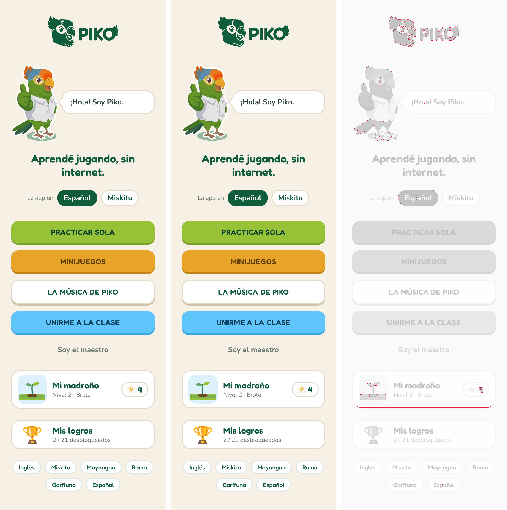

Izquierda: la app. Centro: lo que arma el plugin. Derecha: en rojo, los píxeles que difieren.

## Las pantallas clave

Las cuatro que pide el entregable — inicio, funcionalidad principal y perfil —
más el ejercicio, que es donde el estudiante pasa la mayor parte del tiempo.

### Inicio

<table><tr><td width="260">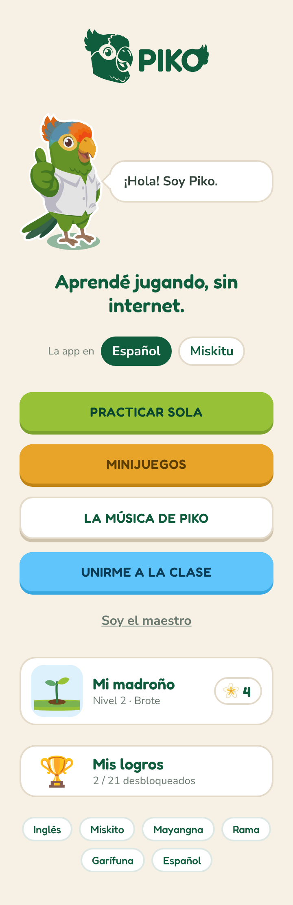</td><td>

Portada: Piko saluda, se elige la lengua de la app y el camino.

**Tamaño del marco:** 360 × 1108 px (la pantalla completa con su scroll desplegado)

**Ruta en la app:** `/`

**Componentes usados:** Etiqueta de lengua ×6 · Botón ×4 · Chip de idioma ×2 · Tarjeta de acceso ×2 · Piko ×1 · Globo de diálogo ×1 · Madroño miniatura ×1 · Contador de sacuanjoches ×1 · Sacuanjoche ×1

**Prototipo:** «Practicar sola» → Practicar · Elegir tema · «Minijuegos» → Minijuegos · «La Música de Piko» → La Música de Piko · «Unirme a la clase» → Unirme a la clase · «Soy el maestro» → Mi clase (maestro) · «Mi madroño» → Perfil · «Mis logros» → Mis logros

**Diferencia con la app:** 0.24 % de píxeles

</td></tr></table>

### Practicar · Elegir tema

<table><tr><td width="260">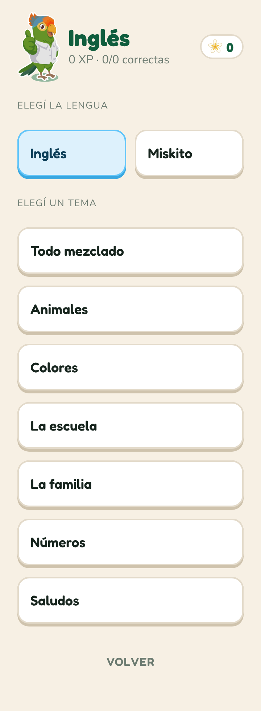</td><td>

Práctica en solitario: lengua a aprender y tema de la ronda.

**Tamaño del marco:** 360 × 976 px (la pantalla completa con su scroll desplegado)

**Ruta en la app:** `/practicar`

**Componentes usados:** Opción ×9 · Piko ×1 · Contador de sacuanjoches ×1 · Sacuanjoche ×1 · Botón ×1

**Prototipo:** «Todo mezclado» → Ejercicio · Opción múltiple · «Volver» → Inicio

**Diferencia con la app:** 0.17 % de píxeles

</td></tr></table>

### Ejercicio · Opción múltiple

<table><tr><td width="260">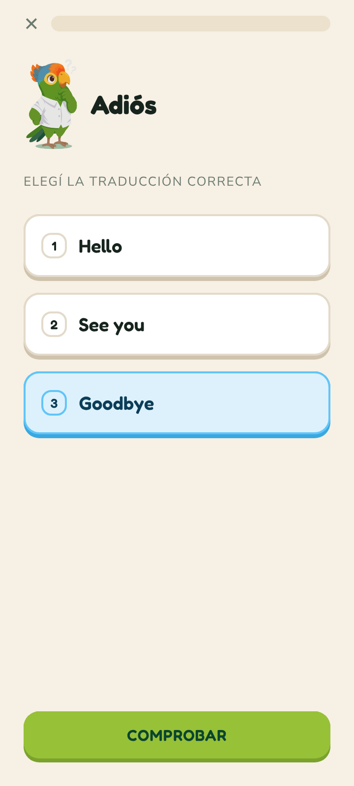</td><td>

Traducción por selección. La opción tocada queda en celeste hasta comprobar.

**Tamaño del marco:** 360 × 800 px

**Componentes usados:** Opción ×3 · Barra de progreso ×1 · Piko ×1 · Botón ×1

**Prototipo:** «Comprobar» → Ejercicio · Respuesta correcta

**Diferencia con la app:** 1.31 % de píxeles

</td></tr></table>

### Perfil

<table><tr><td width="260">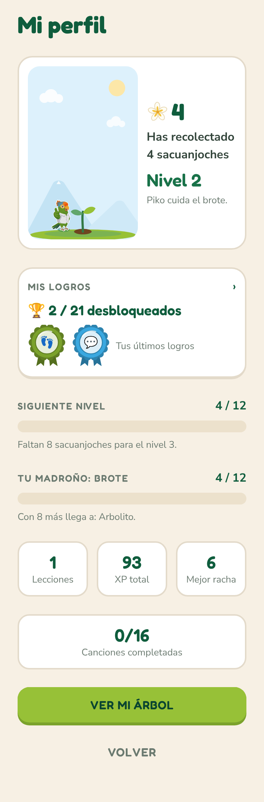</td><td>

El perfil del estudiante: madroño, sacuanjoches, nivel, logros y datos.

**Tamaño del marco:** 360 × 1089 px (la pantalla completa con su scroll desplegado)

**Ruta en la app:** `/perfil`

**Componentes usados:** Tarjeta de dato ×4 · Insignia de logro ×2 · Barra de progreso ×2 · Botón ×2 · Madroño ×1 · Piko ×1 · Sacuanjoche ×1

**Prototipo:** «Ver mi árbol» → Mi madroño · «Volver» → Inicio · «Mis logros» → Mis logros

**Diferencia con la app:** 1.18 % de píxeles

</td></tr></table>

## Todas las pantallas

<b>Inicio</b> · 1 pantalla

<b>Aprender</b> · 7 pantallas

### Ejercicio · Respuesta correcta

<table><tr><td width="260">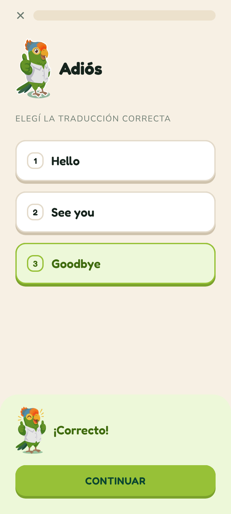</td><td>

Piko festeja: la barra de respuesta sube en verde.

**Tamaño del marco:** 360 × 800 px

**Componentes usados:** Opción ×3 · Piko ×2 · Barra de progreso ×1 · Barra de respuesta ×1 · Botón ×1

**Prototipo:** «Continuar» → Ejercicio · Armar oración

**Diferencia con la app:** 0.41 % de píxeles

</td></tr></table>

### Ejercicio · Armar oración

<table><tr><td width="260">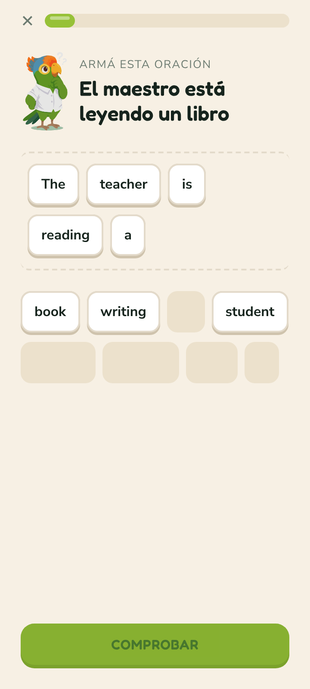</td><td>

Se tocan las fichas para llevarlas al renglón; las usadas dejan su hueco.

**Tamaño del marco:** 360 × 800 px

**Componentes usados:** Ficha de palabra ×13 · Barra de progreso ×1 · Piko ×1 · Botón ×1

**Prototipo:** «Comprobar» → Ejercicio · Seguí intentando

**Diferencia con la app:** 0.20 % de píxeles

</td></tr></table>

### Ejercicio · Seguí intentando

<table><tr><td width="260">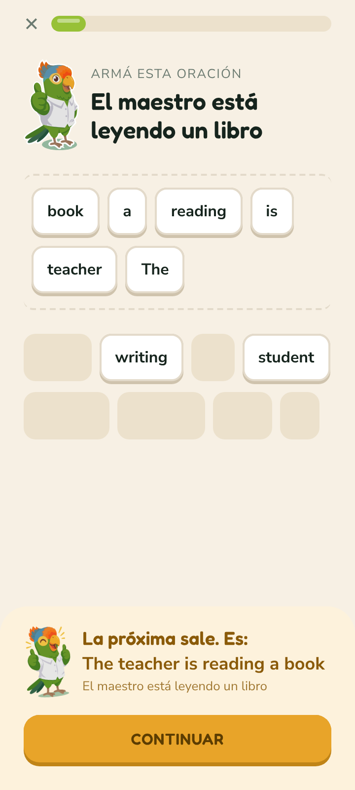</td><td>

Error en ámbar, nunca en rojo: se muestra la respuesta sin regañar.

**Tamaño del marco:** 360 × 800 px

**Componentes usados:** Ficha de palabra ×14 · Piko ×2 · Barra de progreso ×1 · Barra de respuesta ×1 · Botón ×1

**Prototipo:** «Continuar» → Logro desbloqueado

**Diferencia con la app:** 0.57 % de píxeles

</td></tr></table>

### Ejercicio · Escuchar

<table><tr><td width="260">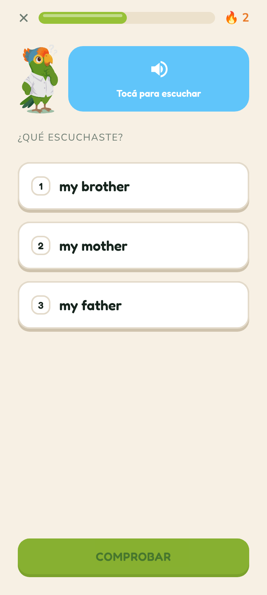</td><td>

Comprensión auditiva: Piko pronuncia y se elige lo escuchado.

**Tamaño del marco:** 360 × 800 px

**Componentes usados:** Opción ×3 · Barra de progreso ×1 · Piko ×1 · Botón ×1

**Diferencia con la app:** 0.32 % de píxeles

</td></tr></table>

### Resultado de la lección

<table><tr><td width="260">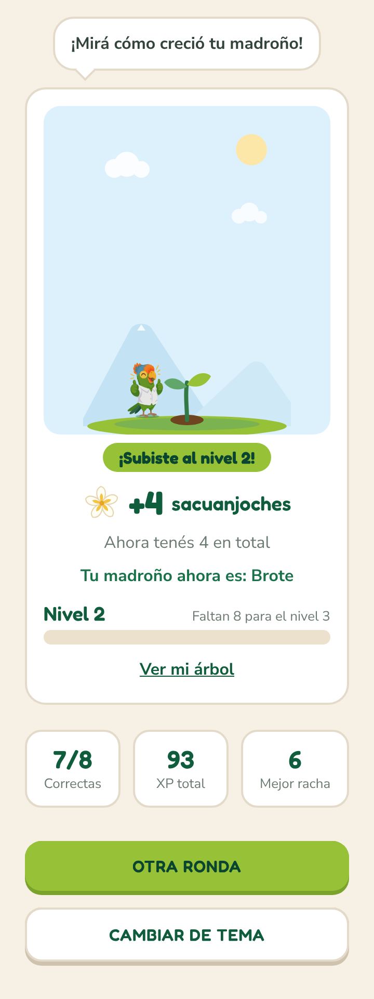</td><td>

Fin de ronda: sacuanjoches ganadas, el madroño y el marcador.

**Tamaño del marco:** 360 × 961 px (la pantalla completa con su scroll desplegado)

**Componentes usados:** Tarjeta de dato ×3 · Botón ×2 · Globo de diálogo ×1 · Madroño ×1 · Piko ×1 · Sacuanjoche ×1 · Barra de progreso ×1

**Prototipo:** «Ver mi árbol» → Mi madroño · «Otra ronda» → Ejercicio · Opción múltiple · «Cambiar de tema» → Practicar · Elegir tema

**Diferencia con la app:** 0.19 % de píxeles

</td></tr></table>

<b>Progreso</b> · 5 pantallas

### Logro desbloqueado

<table><tr><td width="260">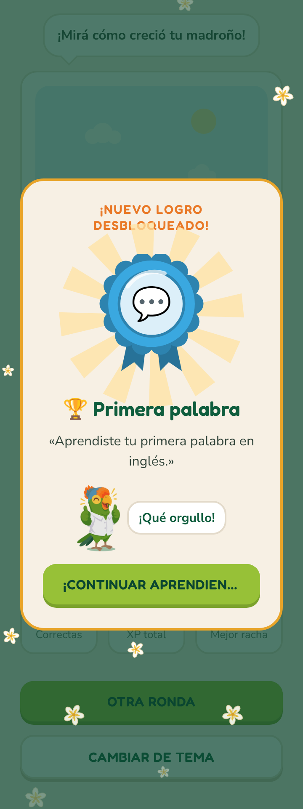</td><td>

La celebración de un logro nuevo, al terminar la ronda.

**Tamaño del marco:** 360 × 961 px (la pantalla completa con su scroll desplegado)

**Componentes usados:** Sacuanjoche ×13 · Tarjeta de dato ×3 · Botón ×3 · Piko ×2 · Globo de diálogo ×1 · Madroño ×1 · Barra de progreso ×1 · Insignia de logro ×1

**Prototipo:** «¡Continuar aprendiendo!» → Resultado de la lección

**Diferencia con la app:** 6.57 % de píxeles (tiene animaciones continuas: rayos que giran y flores que caen)

</td></tr></table>

### Mi madroño

<table><tr><td width="260">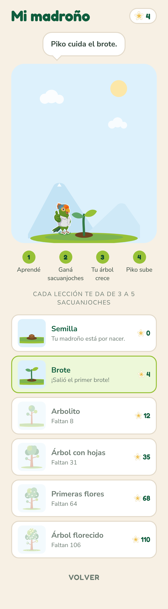</td><td>

El árbol en grande y el camino de semilla a árbol florecido.

**Tamaño del marco:** 360 × 1298 px (la pantalla completa con su scroll desplegado)

**Ruta en la app:** `/arbol`

**Componentes usados:** Sacuanjoche ×7 · Etapa del madroño ×6 · Madroño miniatura ×6 · Paso del ciclo ×4 · Contador de sacuanjoches ×1 · Globo de diálogo ×1 · Madroño ×1 · Piko ×1 · Botón ×1

**Prototipo:** «Volver» → Perfil

**Diferencia con la app:** 2.22 % de píxeles

</td></tr></table>

### Mis logros

<table><tr><td width="260">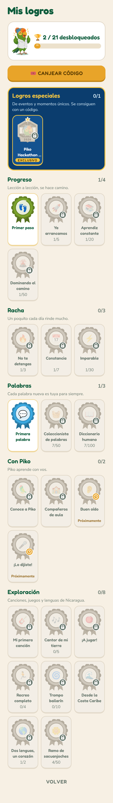</td><td>

Insignias por categoría: ganadas a color, pendientes con candado.

**Tamaño del marco:** 360 × 2548 px (la pantalla completa con su scroll desplegado)

**Ruta en la app:** `/logros`

**Componentes usados:** Celda de logro ×23 · Insignia de logro ×23 · Botón ×2 · Piko ×1 · Barra de progreso ×1 · Sacuanjoche ×1

**Prototipo:** «Volver» → Perfil · «Canjear código» → Canjear código

**Diferencia con la app:** 1.56 % de píxeles

</td></tr></table>

### Canjear código

<table><tr><td width="260">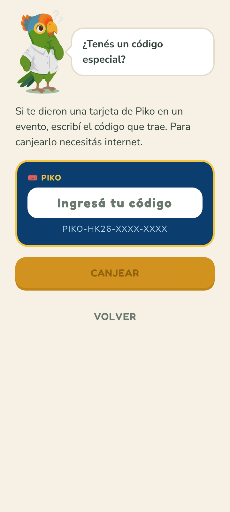</td><td>

Canje de códigos de logros especiales (eventos).

**Tamaño del marco:** 360 × 800 px

**Ruta en la app:** `/logros/canjear`

**Componentes usados:** Botón ×2 · Piko ×1 · Globo de diálogo ×1 · Campo de código ×1 · Campo de texto ×1

**Prototipo:** «Volver» → Mis logros

**Diferencia con la app:** 0.24 % de píxeles

</td></tr></table>

<b>Jugar y cantar</b> · 2 pantallas

### Minijuegos

<table><tr><td width="260">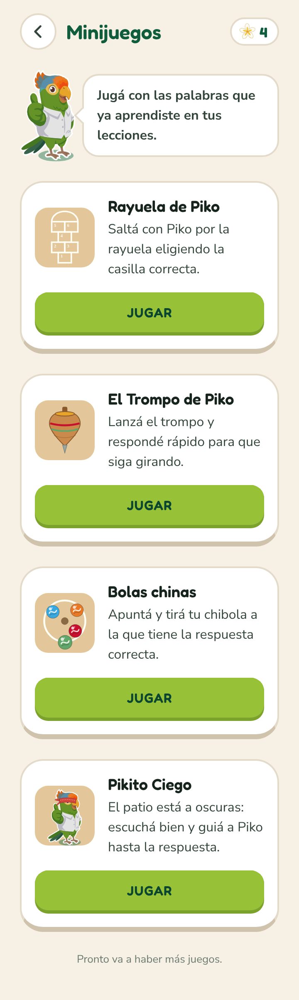</td><td>

Juegos tradicionales nicaragüenses con las palabras de las lecciones.

**Tamaño del marco:** 360 × 1204 px (la pantalla completa con su scroll desplegado)

**Ruta en la app:** `/minijuegos`

**Componentes usados:** Tarjeta de minijuego ×4 · Botón ×4 · Piko ×2 · Encabezado de pantalla ×1 · Botón circular ×1 · Contador de sacuanjoches ×1 · Sacuanjoche ×1 · Globo de diálogo ×1 · Ícono · Rayuela ×1 · Ícono · Trompo ×1 · Ícono · Chibolas ×1 · Ícono · Gallinita ciega ×1

**Diferencia con la app:** 0.13 % de píxeles

</td></tr></table>

### La Música de Piko

<table><tr><td width="260">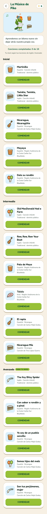</td><td>

Canciones por nivel, con el rastro de sacuanjoches.

**Tamaño del marco:** 360 × 3830 px (la pantalla completa con su scroll desplegado)

**Ruta en la app:** `/musica`

**Componentes usados:** Instrumento ×18 · Tarjeta de canción ×16 · Botón ×16 · Encabezado de pantalla ×1 · Botón circular ×1 · Contador de sacuanjoches ×1 · Sacuanjoche ×1 · Piko ×1 · Globo de diálogo ×1

**Diferencia con la app:** 0.30 % de píxeles

</td></tr></table>

<b>En clase</b> · 2 pantallas

### Unirme a la clase

<table><tr><td width="260">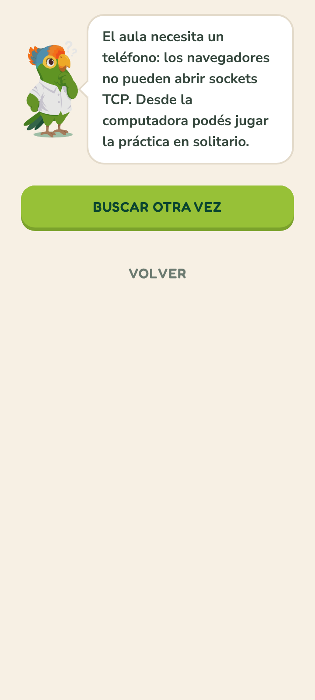</td><td>

El estudiante busca la sala del maestro en la red local.

**Tamaño del marco:** 360 × 800 px

**Ruta en la app:** `/estudiante/unirse`

**Componentes usados:** Botón ×2 · Piko ×1 · Globo de diálogo ×1

**Prototipo:** «Volver» → Inicio

**Diferencia con la app:** 0.26 % de píxeles

</td></tr></table>

### Mi clase (maestro)

<table><tr><td width="260">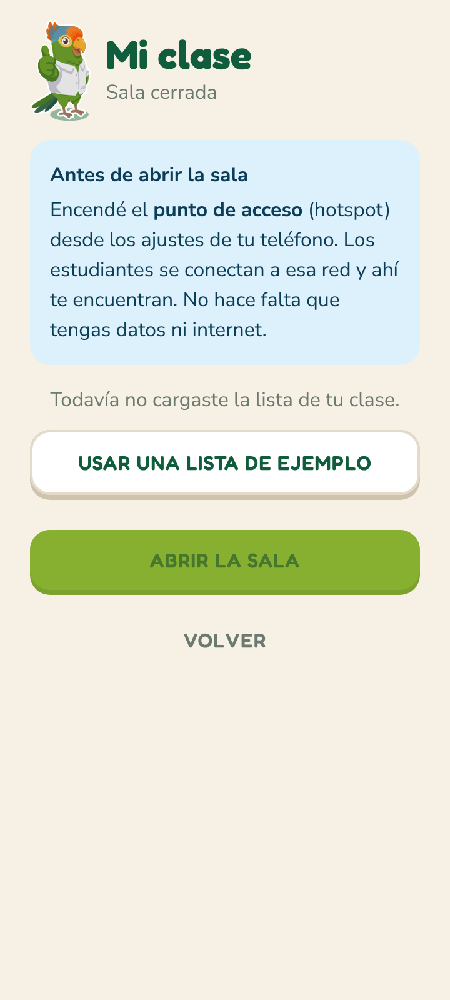</td><td>

El maestro abre la sala desde su hotspot y sigue a la clase.

**Tamaño del marco:** 360 × 800 px

**Ruta en la app:** `/maestro`

**Componentes usados:** Botón ×3 · Piko ×1 · Aviso informativo ×1

**Prototipo:** «Volver» → Inicio

**Diferencia con la app:** 0.31 % de píxeles

</td></tr></table>

## Lo que aplica cada pantalla del manual

| Regla del manual | Dónde se ve |
|---|---|
| Fondo papel `#F7F0E4`, superficies blancas con borde `#E3DACA` | Todas |
| Títulos en Fredoka (Display 32, Título 24, Subtítulo 19) | Encabezados de Perfil, Logros, Madroño; enunciados de ejercicios |
| Cuerpo en Nunito Sans 16/24 y Chico 13/18 | Descripciones, ayudas, globos de Piko |
| Botones planos con labio de 4 px, en mayúsculas | Las acciones de todas las pantallas |
| El error en ámbar, nunca en rojo | «Seguí intentando», opción fallada |
| Piko acompaña: nunca enojado ni triste | Saluda en Inicio, piensa en los ejercicios, festeja en el resultado |
| Radios generosos: sm 10, md 16, lg 20, xl 28, redondo 999 | Tarjetas, opciones, chips |

---

Generado por `figma/captura/documentar.mjs` a partir de la captura del 9 de octubre de 2026. Las cifras y tablas salen de la app real; para actualizarlas, ver [figma/README.md](../../figma/README.md).
