# 2 · Sistema de componentes de UI

La biblioteca de elementos reutilizables de Piko, coherente con la guía de
color y tipografía del manual. Cada componente existe en tres lugares que
dicen lo mismo:

| Dónde | Qué es |
|---|---|
| **El código** (`app/src/ui`, `app/src/features`) | La fuente de verdad. Lo que se ve en el teléfono. |
| **Figma** (página 🧩 Componentes) | Component sets con variantes, auto layout, colores enlazados a variables y textos con estilos. Las pantallas de 📱 usan instancias de estos. |
| **Este documento** | La referencia para desarrollo: qué variantes hay, cuándo usar cada una, de qué archivo sale. |

Hay dos tipos de componente:

- **De código**: un componente de React (`Boton`, `Opcion`, `Globo`…). El
  capturador lee del árbol de React con qué props se montó cada uno, y eso
  decide su variante en Figma (por ejemplo `tono="pico"` → `Tono=pico`).
- **Patrones**: estructuras que se repiten en varias pantallas sin ser todavía
  un componente de React — encabezados, tarjetas, chips, campos. Se reconocen
  por su estilo y su contenido. Son candidatos naturales a extraerse a
  `app/src/ui/components` cuando se toquen esas pantallas.

Cuando un componente lleva otro adentro (la insignia dentro de la celda de
logro, Piko dentro de la barra de respuesta), en Figma se cambia con
**instance swap**, sin multiplicar variantes.

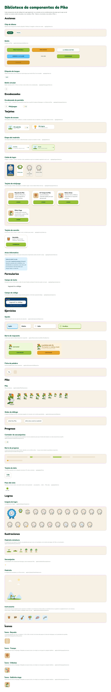

## Fundamentos

Todos salen de [`app/src/ui/tokens.ts`](../../app/src/ui/tokens.ts). En Figma son
la colección de variables **Piko · Tokens** y los estilos de texto **Piko/…**.

### Color

| | Token | Valor | Contraste sobre papel |
|---|---|---|---|
|  | `verde` | `#0F5D3D` | 6.99 |
|  | `verdeHondo` | `#0A4530` | 9.72 |
|  | `verdeBosque` | `#197249` | 5.23 |
|  | `verdeMonte` | `#327945` | 4.69 |
|  | `verdeHoja` | `#61A66B` | 2.58 |
|  | `verdePasto` | `#97C137` | 1.85 |
|  | `cielo` | `#60C5FA` | 1.71 |
|  | `cieloHondo` | `#3AA8E0` | 2.36 |
|  | `nube` | `#DDF1FC` | 1.03 |
|  | `papel` | `#F7F0E4` | 1.00 |
| 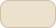 | `papelHondo` | `#ECE1CC` | 1.14 |
|  | `blanco` | `#FFFFFF` | 1.13 |
|  | `copete` | `#E97927` | 2.56 |
|  | `pico` | `#E8A429` | 1.90 |
|  | `picoHondo` | `#C9862060` | — |
|  | `grafito` | `#16241D` | 14.21 |
|  | `tinta` | `#33453B` | 9.02 |
|  | `tintaSuave` | `#6B7A70` | 3.99 |
| 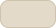 | `borde` | `#E3DACA` | 1.22 |
|  | `bordeHondo` | `#CFC3AD` | 1.54 |
|  | `acierto` | `#97C137` | 1.85 |
|  | `aciertoFondo` | `#EDF8D9` | 1.03 |
|  | `aciertoTinta` | `#3F6B0E` | 5.58 |
|  | `intento` | `#E8A429` | 1.90 |
|  | `intentoFondo` | `#FDF2DC` | 1.02 |
|  | `intentoTinta` | `#8A5A08` | 5.23 |

El error es **ámbar** (`intento`), nunca rojo: Piko refuerza sin regañar.

### Tipografía

Dos familias, las mismas de la landing, empaquetadas en la app para que
funcione sin internet: **Fredoka** (títulos y botones) y **Nunito Sans** (cuerpo).

| Estilo | Fuente | Tamaño / alto | Espaciado | Caja | Uso |
|---|---|---|---|---|---|
| **display** | Fredoka 700Bold | 32 / 36 | 0 | — | Título de pantalla, números grandes |
| **titulo** | Fredoka 600SemiBold | 24 / 29 | 0 | — | Lema, valores de las tarjetas de dato |
| **subtitulo** | Fredoka 600SemiBold | 19 / 24 | 0 | — | Opciones, títulos de tarjetas y de la barra de respuesta |
| **cuerpo** | NunitoSans 400Regular | 16 / 24 | 0 | — | Texto corrido, descripciones |
| **cuerpoFuerte** | NunitoSans 700Bold | 16 / 24 | 0 | — | Globos de Piko, fichas, énfasis |
| **chico** | NunitoSans 400Regular | 13 / 18 | 0 | — | Ayudas, subtítulos, etiquetas de dato |
| **etiqueta** | Fredoka 600SemiBold | 13 | 1.2 | MAYÚSC. | Rótulos en mayúsculas sobre secciones |
| **Botón** | Fredoka SemiBold | 16 | 0.6 | MAYÚSC. | Todos los botones (14 en los chicos) |

### Espaciado, radios y volumen

- Escala de 4 puntos: `xs` 4 · `sm` 8 · `md` 12 · `lg` 16 · `xl` 24 · `xxl` 32 · `xxxl` 48.
- Radios: `sm` 10 · `md` 16 · `lg` 20 · `xl` 28 · `redondo` 999.
- **Labio**: borde inferior más oscuro de 4 px (3 px en los chicos) que da volumen sin sombras ni degradados — más barato en gama baja.
- Animaciones: 120 / 200 / 380 ms.

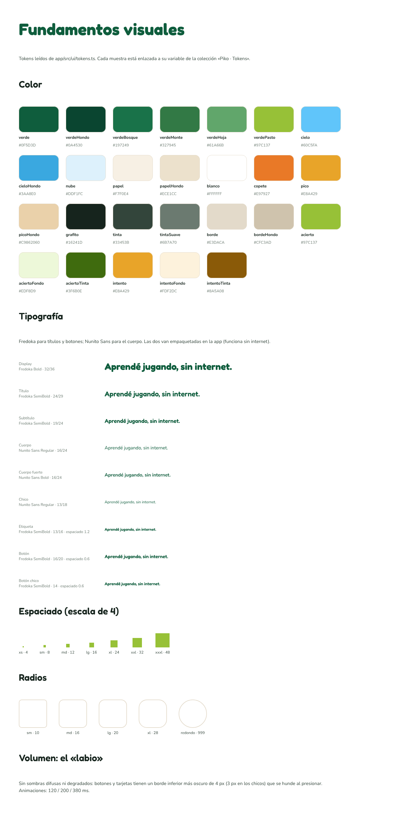

## Componentes

## Acciones

### Botón

El botón de Piko.  
Código: [`app/src/ui/components/Boton.tsx`](../../app/src/ui/components/Boton.tsx)

**Propiedades de variante en Figma:** `Tono`, `Tamaño`, `Estado` · **Usos en las pantallas:** 47

<table><tr><td align="center">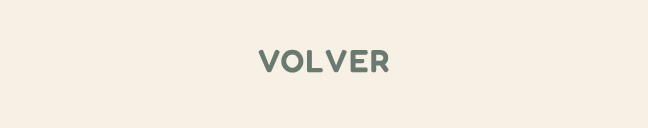 fantasma · normal · activo</td><td align="center">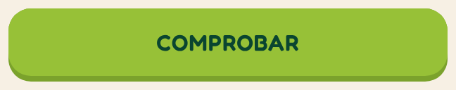 verde · normal · deshabilitado</td><td align="center">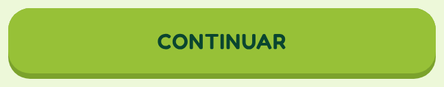 verde · normal · activo</td><td align="center">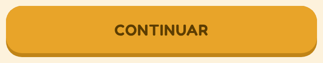 pico · normal · activo</td><td align="center"> papel · normal · activo</td><td align="center">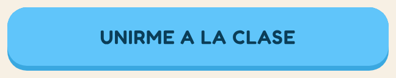 cielo · normal · activo</td><td align="center">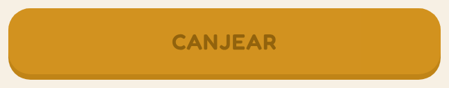 pico · normal · deshabilitado</td></tr></table>

| Tono | Cuándo |
|---|---|
| **verde** | La acción principal de la pantalla: Practicar, Comprobar, Continuar. Una sola por pantalla. |
| **pico** (ámbar) | Juego y alternativas festivas: Minijuegos, Canjear código; continuar tras un intento. |
| **papel** | Acción secundaria al lado de una principal: Cambiar de tema, La Música de Piko. |
| **cielo** | Lo que tiene que ver con la clase en red: Unirme a la clase. |
| **fantasma** | Volver o salir. Sin fondo ni labio. |

Siempre en mayúsculas (Fredoka SemiBold 16, espaciado 0.6), una sola línea; si no entra, se corta con «…». Deshabilitado = 45 % de opacidad. Al tocarlo, el cuerpo baja los 4 px del labio en 60 ms.

### Botón circular

Botón redondo de 44 × 44 con un ícono: volver atrás en los encabezados.  
Código: [`app/minijuegos/index.tsx`](../../app/minijuegos/index.tsx)

**Usos en las pantallas:** 2

<table><tr><td align="center">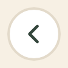 base</td></tr></table>

### Chip de idioma

Selector de la lengua de la interfaz (Español / Miskitu). El elegido va relleno de verde.  
Código: [`app/index.tsx`](../../app/index.tsx)

**Propiedades de variante en Figma:** `Estado` · **Usos en las pantallas:** 2

<table><tr><td align="center">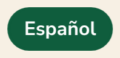 elegido</td><td align="center">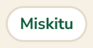 normal</td></tr></table>

### Etiqueta de lengua

Píldora informativa con el nombre de cada lengua que enseña Piko. No es tocable.  
Código: [`app/index.tsx`](../../app/index.tsx)

**Usos en las pantallas:** 6

<table><tr><td align="center">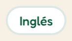 base</td></tr></table>

## Encabezados

### Encabezado de pantalla

Volver + título + contador de sacuanjoches (que lleva al perfil). Encabeza Minijuegos y La Música de Piko.  
Código: [`app/minijuegos/index.tsx`](../../app/minijuegos/index.tsx)

**Usos en las pantallas:** 2

<table><tr><td align="center">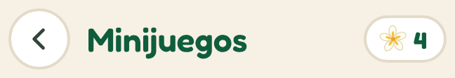 base</td></tr></table>

Patrón para pantallas secundarias: botón circular de volver (44 × 44), título y el contador de sacuanjoches, que también es un acceso al perfil.

## Tarjetas

### Tarjeta de acceso

Fila tocable con ícono, título, subtítulo y un dato a la derecha: lleva al madroño y a los logros desde el inicio.  
Código: [`app/index.tsx`](../../app/index.tsx)

**Usos en las pantallas:** 2

<table><tr><td align="center">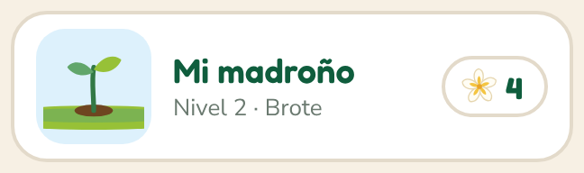 base</td><td align="center">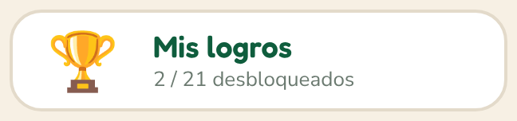 base</td></tr></table>

### Tarjeta de minijuego

Ícono del juego, nombre, descripción y el botón «Jugar». Lleva el labio inferior de 6 px.  
Código: [`app/minijuegos/index.tsx`](../../app/minijuegos/index.tsx)

**Usos en las pantallas:** 4

<table><tr><td align="center">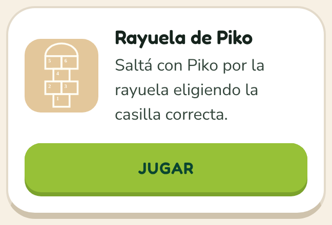 base</td><td align="center">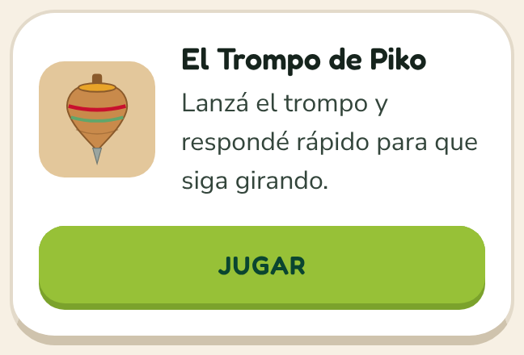 base</td><td align="center">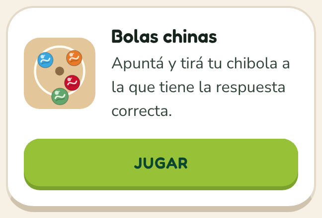 base</td><td align="center">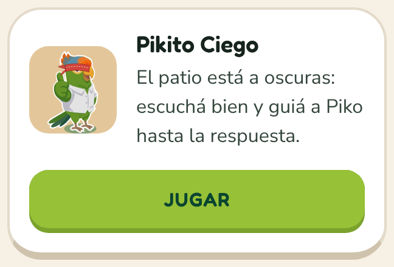 base</td></tr></table>

### Tarjeta de canción

Instrumento, título, lengua y región, nivel y el botón para cantar.  
Código: [`app/musica/index.tsx`](../../app/musica/index.tsx)

**Usos en las pantallas:** 16

<table><tr><td align="center">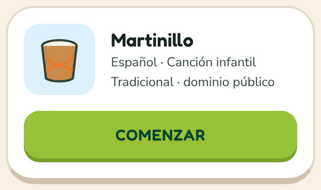 base</td></tr></table>

### Celda de logro

Insignia + nombre + avance. Ganada a color, pendiente en gris con candado, especial en azul y oro.  
Código: [`app/logros/index.tsx`](../../app/logros/index.tsx)

**Propiedades de variante en Figma:** `Estado` · **Usos en las pantallas:** 23

<table><tr><td align="center">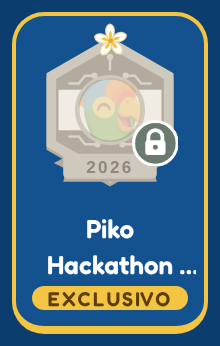 especial</td><td align="center">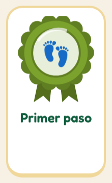 ganada</td><td align="center">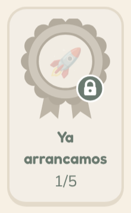 pendiente</td><td align="center">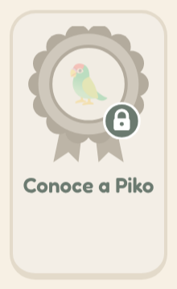 pendiente</td></tr></table>

### Etapa del madroño

Una etapa del camino de semilla a árbol florecido; la actual se resalta en verde.  
Código: [`app/arbol.tsx`](../../app/arbol.tsx)

**Propiedades de variante en Figma:** `Estado` · **Usos en las pantallas:** 6

<table><tr><td align="center">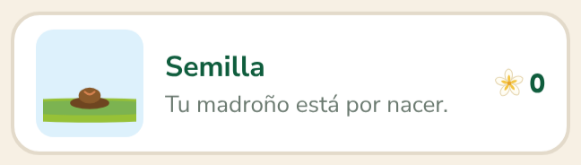 normal</td><td align="center">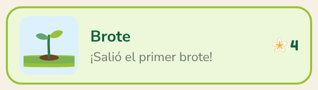 actual</td></tr></table>

### Aviso informativo

Bloque celeste con título y texto para instrucciones importantes (antes de abrir la sala).  
Código: [`app/maestro/index.tsx`](../../app/maestro/index.tsx)

**Usos en las pantallas:** 1

<table><tr><td align="center">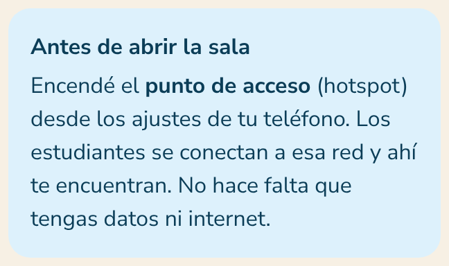 base</td></tr></table>

## Formularios

### Campo de código

Formulario de canje: etiqueta, campo de texto grande y el formato esperado debajo.  
Código: [`app/logros/canjear.tsx`](../../app/logros/canjear.tsx)

**Usos en las pantallas:** 1

<table><tr><td align="center">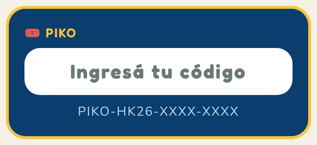 base</td></tr></table>

Formulario de un solo campo. La etiqueta va arriba, el campo es grande (48 px) y centrado, y el formato esperado se muestra debajo como ejemplo.

### Campo de texto

Entrada de texto: fondo blanco, radio 16, texto Fredoka centrado. El texto de ayuda va en gris.  
Código: [`app/logros/canjear.tsx`](../../app/logros/canjear.tsx)

**Usos en las pantallas:** 1

<table><tr><td align="center">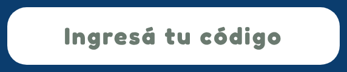 base</td></tr></table>

## Ejercicios

### Opción

Tarjeta de opción para los ejercicios de selección.  
Código: [`app/src/ui/components/Opcion.tsx`](../../app/src/ui/components/Opcion.tsx)

**Propiedades de variante en Figma:** `Estado`, `Atajo` · **Usos en las pantallas:** 18

<table><tr><td align="center">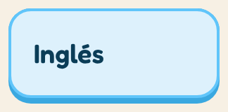 elegida · sin número</td><td align="center">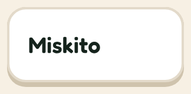 normal · sin número</td><td align="center">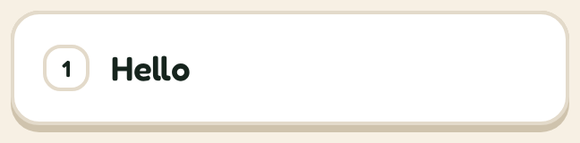 normal · con número</td><td align="center">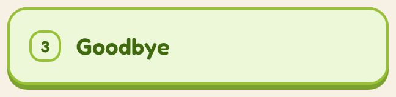 correcta · con número</td></tr></table>

Cuatro estados: **normal** (blanco), **elegida** (celeste, antes de comprobar), **correcta** (verde) y **fallada** (ámbar — nunca rojo). Con número de atajo en los ejercicios; sin número para elegir lengua o tema. Alto mínimo 64 px.

### Ficha de palabra

Ficha de palabra para armar oraciones.  
Código: [`app/src/ui/components/Bloque.tsx`](../../app/src/ui/components/Bloque.tsx)

**Propiedades de variante en Figma:** `Estado` · **Usos en las pantallas:** 27

<table><tr><td align="center">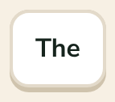 normal</td><td align="center">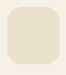 hueco</td></tr></table>

La ficha se toca (no se arrastra): sube al renglón y deja su **hueco** en el banco para que nada se reacomode bajo el dedo.

### Barra de respuesta

La barra que aparece abajo después de responder.  
Código: [`app/src/features/exercises/BarraFeedback.tsx`](../../app/src/features/exercises/BarraFeedback.tsx)

**Propiedades de variante en Figma:** `Resultado` · **Usos en las pantallas:** 2

<table><tr><td align="center">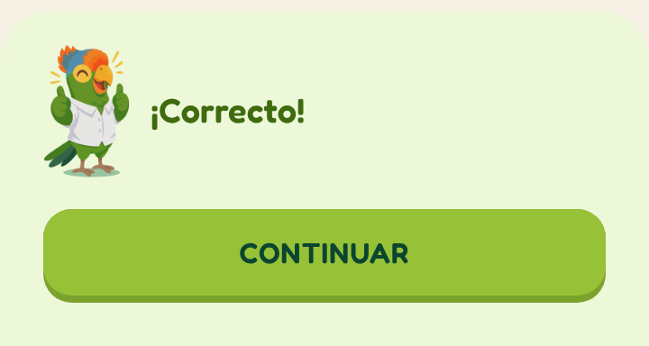 acierto</td><td align="center">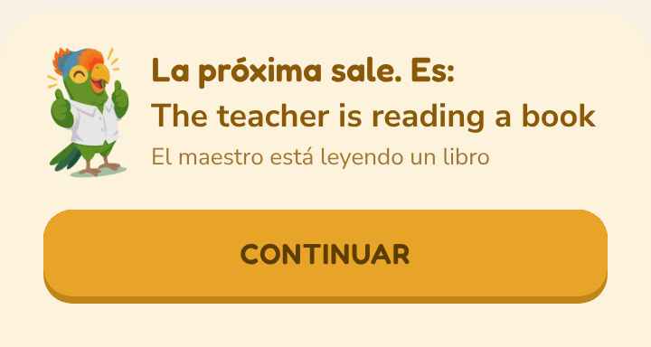 intento</td></tr></table>

Aparece desde abajo al comprobar. **Acierto**: verde, Piko alegre. **Intento**: ámbar, Piko animando, y muestra la respuesta correcta sin decir nunca «incorrecto».

## Piko

### Globo de diálogo

El globo de diálogo de Piko. Va siempre pegado a la mascota, con la colita apuntándole.  
Código: [`app/src/ui/components/Globo.tsx`](../../app/src/ui/components/Globo.tsx)

**Propiedades de variante en Figma:** `Cola` · **Usos en las pantallas:** 8

<table><tr><td align="center">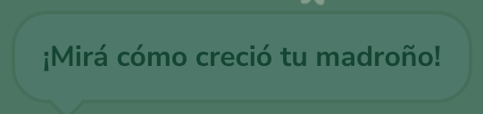 abajo</td><td align="center">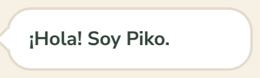 izquierda</td></tr></table>

Siempre pegado a Piko, con la cola hacia él: a la **izquierda** cuando Piko está al costado, **abajo** cuando está debajo.

### Piko

Piko, el chocoyo.  
Código: [`app/src/ui/piko/PikoMascota.tsx`](../../app/src/ui/piko/PikoMascota.tsx)

**Propiedades de variante en Figma:** `Estado` · **Usos en las pantallas:** 21

<table><tr><td align="center">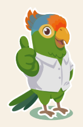 idle</td><td align="center">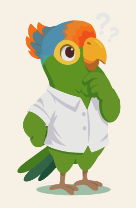 pensando</td><td align="center">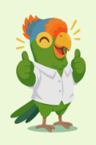 alegre</td><td align="center">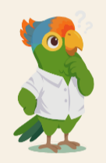 pensando</td><td align="center">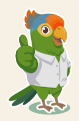 idle</td><td align="center">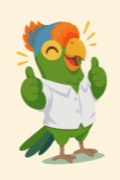 animando</td><td align="center">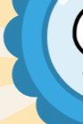 celebrando</td><td align="center">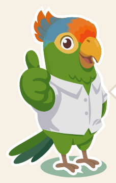 saludando</td></tr></table>

…y 2 variantes más en Figma.

## Progreso

### Barra de progreso

La barra de avance de la ronda. Gorda, redonda y con un brillo arriba — la que corona todas las pantallas de ejercicio.  
Código: [`app/src/ui/components/BarraProgreso.tsx`](../../app/src/ui/components/BarraProgreso.tsx)

**Propiedades de variante en Figma:** `Tono`, `Avance` · **Usos en las pantallas:** 10

<table><tr><td align="center">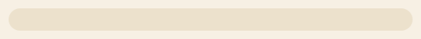 verdePasto · 0%</td><td align="center"> verdePasto · 13%</td><td align="center"> verdePasto · 50%</td><td align="center"> verdeHoja · 0%</td><td align="center"> pico · 10%</td></tr></table>

### Contador de sacuanjoches

La pastilla con las sacuanjoches del estudiante. Va en las cabeceras para que el total esté siempre a la vista; tocarla lleva al perfil.  
Código: [`app/src/ui/arbol/ContadorSacuanjoches.tsx`](../../app/src/ui/arbol/ContadorSacuanjoches.tsx)

**Usos en las pantallas:** 5

<table><tr><td align="center"> base</td></tr></table>

### Tarjeta de dato

Un número grande con su etiqueta: lecciones, XP, racha, correctas.  
Código: [`app/perfil.tsx`](../../app/perfil.tsx)

**Usos en las pantallas:** 10

<table><tr><td align="center"> base</td></tr></table>

### Paso del ciclo

Número en círculo verde y una acción corta: el ciclo aprender → sacuanjoches → árbol → Piko sube.  
Código: [`app/arbol.tsx`](../../app/arbol.tsx)

**Usos en las pantallas:** 4

<table><tr><td align="center"> base</td></tr></table>

## Logros

### Insignia de logro

La insignia de un logro.  
Código: [`app/src/ui/logros/Insignia.tsx`](../../app/src/ui/logros/Insignia.tsx)

**Propiedades de variante en Figma:** `Logro`, `Estado` · **Usos en las pantallas:** 26

<table><tr><td align="center"> primera-palabra · ganada</td><td align="center"> primer-paso · ganada</td><td align="center"> piko-hackathon-2026 · bloqueada</td><td align="center"> ya-arrancamos · bloqueada</td><td align="center"> aprendiz-constante · bloqueada</td><td align="center"> dominando-el-camino · bloqueada</td><td align="center"> no-te-detengas · bloqueada</td><td align="center"> constancia · bloqueada</td></tr></table>

…y 15 variantes más en Figma.

## Ilustraciones

### Sacuanjoche

La sacuanjoche, flor nacional de Nicaragua, como moneda de Piko.  
Código: [`app/src/ui/arbol/Sacuanjoche.tsx`](../../app/src/ui/arbol/Sacuanjoche.tsx)

**Usos en las pantallas:** 27

<table><tr><td align="center"> base</td></tr></table>

### Madroño miniatura

El madroño de una etapa en chiquito, encuadrado para que se lea: en la portada y en el camino de etapas. Sin Piko y sin animación.  
Código: [`app/src/ui/arbol/MiniaturaArbol.tsx`](../../app/src/ui/arbol/MiniaturaArbol.tsx)

**Propiedades de variante en Figma:** `Etapa` · **Usos en las pantallas:** 7

<table><tr><td align="center"> brote</td><td align="center"> semilla</td><td align="center"> arbolito</td><td align="center"> hojas</td><td align="center"> flores</td><td align="center"> florecido</td></tr></table>

### Madroño

El madroño del estudiante, con Piko encima.  
Código: [`app/src/ui/arbol/ArbolMadrono.tsx`](../../app/src/ui/arbol/ArbolMadrono.tsx)

**Propiedades de variante en Figma:** `Sacuanjoches` · **Usos en las pantallas:** 4

<table><tr><td align="center"> 4</td></tr></table>

### Instrumento

Instrumentos para las tarjetas de las canciones: el tambor y la concha de la Costa Caribe, la marimba de arco, la guitarra, la quijada de burro y las maracas. Pocos trazos y colores de la paleta: se dibujan varios a la vez.  
Código: [`app/src/ui/musica/Instrumento.tsx`](../../app/src/ui/musica/Instrumento.tsx)

**Propiedades de variante en Figma:** `Dibujo` · **Usos en las pantallas:** 18

<table><tr><td align="center"> tambor</td><td align="center"> marimba</td><td align="center"> guitarra</td><td align="center"> maracas</td><td align="center"> concha</td><td align="center"> quijada</td></tr></table>

## Íconos

### Ícono · Gallinita ciega

Íconos de trazo de los minijuegos. Dibujados con pocos trazos, sin emojis: se ven igual en cualquier teléfono.  
Código: [`app/src/ui/minijuegos/Iconos.tsx`](../../app/src/ui/minijuegos/Iconos.tsx)

**Usos en las pantallas:** 1

<table><tr><td align="center"> base</td></tr></table>

### Ícono · Chibolas

Íconos de trazo de los minijuegos. Dibujados con pocos trazos, sin emojis: se ven igual en cualquier teléfono.  
Código: [`app/src/ui/minijuegos/Iconos.tsx`](../../app/src/ui/minijuegos/Iconos.tsx)

**Usos en las pantallas:** 1

<table><tr><td align="center"> base</td></tr></table>

### Ícono · Trompo

Íconos de trazo de los minijuegos. Dibujados con pocos trazos, sin emojis: se ven igual en cualquier teléfono.  
Código: [`app/src/ui/minijuegos/Iconos.tsx`](../../app/src/ui/minijuegos/Iconos.tsx)

**Usos en las pantallas:** 1

<table><tr><td align="center"> base</td></tr></table>

### Ícono · Rayuela

La rayuela dibujada con tiza, en chiquito: 1, 2|3, 4, 5|6 y el cielo. Es el ícono del juego en la lista de minijuegos y en la portada de la partida.  
Código: [`app/src/ui/minijuegos/IconoRayuela.tsx`](../../app/src/ui/minijuegos/IconoRayuela.tsx)

**Usos en las pantallas:** 1

<table><tr><td align="center"> base</td></tr></table>

## Reglas para sumar un componente

1. Usar los tokens: nada de colores ni tamaños sueltos.
2. Mínimo **44 × 44** de área tocable (ver [accesibilidad](05-accesibilidad.md)).
3. Plano, con labio si se toca; sin sombras difusas.
4. El texto de los botones en una línea; el de las tarjetas puede crecer (auto layout vertical).
5. Si es de código, agregarlo a `CATALOGO` en [`figma/captura/pantallas.mjs`](../../figma/captura/pantallas.mjs) con la función que decide su variante, y volver a capturar.

---

Generado por `figma/captura/documentar.mjs` a partir de la captura del 9 de octubre de 2026. Las cifras y tablas salen de la app real; para actualizarlas, ver [figma/README.md](../../figma/README.md).
