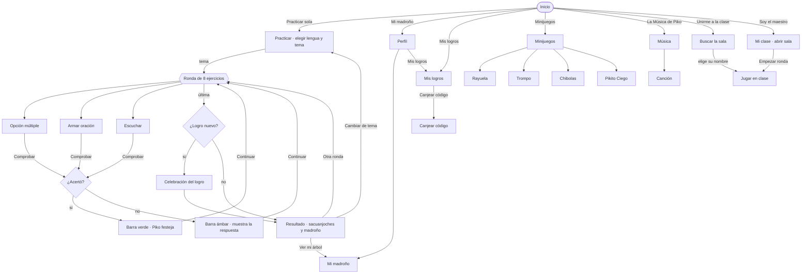
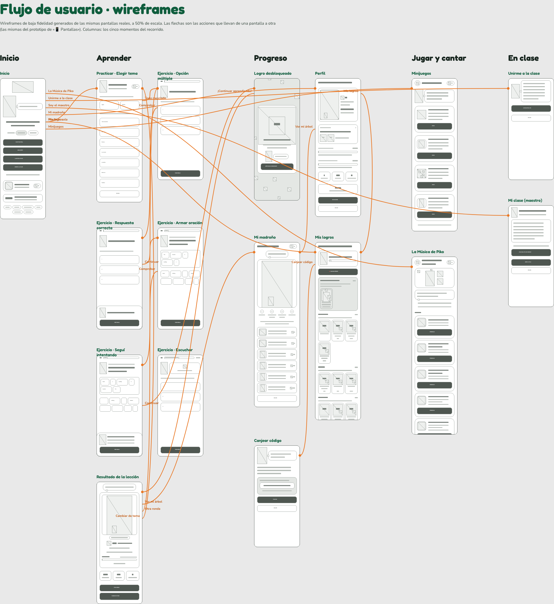

# 3 · Validación y ajuste del flujo UX

## El flujo de usuario

Piko tiene dos caminos que arrancan en la misma portada: **aprender solo**
(funciona sin red, en la casa) y **aprender en clase** (el teléfono del maestro
levanta la sala y los estudiantes se conectan a su hotspot).

En Figma, la página **📱 Pantallas** tiene este flujo como **prototipo**
navegable (26 enlaces, empieza en Inicio) y la página **🔀 Flujo UX**
lo muestra con **wireframes de baja fidelidad** generados de las mismas pantallas:

## Validación: qué funciona

| | Evidencia en las pantallas |
|---|---|
| **Una sola acción principal por pantalla** | El botón verde siempre es el siguiente paso (Practicar sola, Comprobar, Continuar, Otra ronda). |
| **El camino sin red va primero** | «Practicar sola» encabeza la portada: es lo único que funciona sin nadie cerca. |
| **El error no castiga** | Ámbar en vez de rojo, Piko animando y la respuesta correcta a la vista. |
| **Recompensa visible y acumulativa** | Cada lección suma sacuanjoches; el madroño crece y Piko sube de rama. |
| **Ronda corta** | 8 ítems: entra en un recreo y en la batería de un teléfono viejo. |
| **La lengua de la interfaz se elige en la portada** | Español / Miskitu, sin entrar a ajustes. |
| **Tocar en vez de arrastrar** | Las fichas se tocan para moverlas: un dedo chico en una pantalla barata acierta mucho mejor. |

## Hallazgos y ajustes propuestos

Encontrados al recorrer las 17 pantallas y al medir sus elementos
(los tamaños salen de la captura).

| # | Hallazgo | Ajuste | Prioridad |
|---|---|---|---|
| 1 | **La salida del ejercicio es un «✕» de 16 × 24 px** y sale de la ronda sin confirmar: un toque accidental pierde el avance. | Llevarla a 44 × 44 y pedir confirmación («¿Salir de la ronda? Lo que respondiste se guarda»). | Alta |
| 2 | **Volver está en dos lugares**: Minijuegos y Música usan un botón circular arriba; Practicar, Perfil, Madroño y Logros usan un botón «Volver» al final del scroll. En Mis logros (2548 px de alto) hay que bajar todo para salir. | Usar el patrón **Encabezado de pantalla** en todas las pantallas secundarias; dejar el «Volver» de abajo sólo donde el contenido es corto. | Alta |
| 3 | **«¡Continuar aprendiendo!» no entra** en el botón de la celebración: se ve «¡CONTINUAR APRENDIEN…». | Texto más corto («¡A seguir!») o botón de dos líneas. | Media |
| 4 | **El contador de sacuanjoches es un acceso al perfil** pero mide 60 × 34 px y no parece tocable. | Alto mínimo de 44 px y un «›» o borde de botón. | Media |
| 5 | **La celebración del logro se monta sobre el resultado**: el estudiante ve dos premios seguidos y el resultado queda tapado. | Mantener el orden (primero el logro) pero entrar al resultado con su propia animación al cerrar la celebración, para que no parezca la misma pantalla. | Baja |
| 6 | **«Soy el maestro»** es un enlace de texto debajo de cuatro botones grandes: a propósito discreto, pero cuesta encontrarlo la primera vez. | Agregar una línea de ayuda en la pantalla de Unirme («¿Sos el maestro? Abrí la sala acá»). | Baja |
| 7 | **El ejercicio de escuchar depende de la voz del sistema**: en teléfonos sin voz en inglés no suena. | Mostrar el texto escrito como respaldo si no hay voz, y priorizar audios grabados. | Media |

Los ajustes 1 a 4 están reflejados como **componentes** en la biblioteca
(Botón circular, Encabezado de pantalla) para que el cambio en el código sea
reemplazar, no diseñar.

## Wireframes

Cada pantalla tiene su wireframe en la página 🔀 Flujo UX de Figma: cajas
grises para las tarjetas, barras para los textos (más oscuras en los títulos),
cruces para las ilustraciones y los botones en gris oscuro con su texto real.
Salen de la misma captura, así que tienen la jerarquía y las proporciones
exactas de la app.

---

Generado por `figma/captura/documentar.mjs` a partir de la captura del 9 de octubre de 2026. Las cifras y tablas salen de la app real; para actualizarlas, ver [figma/README.md](../../figma/README.md).
