# 4 · Kit de assets para desarrollo

Todas las ilustraciones e íconos que dibuja la app, exportados **tal cual los
dibuja**, listos para el frontend. Están en
[`docs/diseno/assets/`](assets/) y, en Figma, en la página **📦 Assets** como
componentes con la exportación ya configurada.

| Carpeta | Contenido |
|---|---|
| [`assets/svg/`](assets/svg/) | 36 SVG vectoriales (para web o `react-native-svg`) |
| [`assets/png/`](assets/png/) | Los mismos en PNG transparente a **@1x, @2x y @3x** (+ los dos sprites de Piko) |
| [`assets/marca/`](assets/marca/) | Logo (SVG y PNG), Piko vectorial, ícono de la app, splash e íconos adaptativos de Android |
| [`assets/manifiesto.json`](assets/manifiesto.json) | Nombre, archivo, tamaño y en qué pantallas se usa cada uno |
| [`tokens/`](tokens/) | Una muestra SVG por color del manual |

## Cómo usarlos

- **En la app** (React Native): los SVG ya son componentes en `app/src/ui`
  (`PikoMascota`, `Sacuanjoche`, `MiniaturaArbol`, `Insignia`, `Instrumento`…).
  El kit sirve para web, para material impreso y para quien rediseñe.
- **En web**: `` o el SVG en línea.
- **PNG**: usar @2x en pantallas comunes y @3x en las densas. En Android,
  @1x ≈ mdpi, @2x ≈ xhdpi, @3x ≈ xxhdpi.
- **Desde Figma**: en 📦 Assets, seleccionar y **Export** (SVG + PNG ×3 ya configurados).
- **Regenerar**: `npm run exportar` en `figma/captura` (después de capturar).

## Catálogo

### Piko

| Vista | Nombre | Archivos | Tamaño | Dónde aparece |
|---|---|---|---|---|
|  | Piko · idle | [SVG](assets/svg/piko-idle.svg) · [PNG](assets/png/piko-idle.png) · [@2x](assets/png/piko-idle@2x.png) · [@3x](assets/png/piko-idle@3x.png) | 178 × 292 | Practicar · Elegir tema, Ejercicio · Respuesta correcta, Ejercicio · Seguí intentando… |
|  | Piko · pensando | [PNG](assets/png/piko-pensando.png) | 416 × 720 | Ejercicio · Opción múltiple, Ejercicio · Armar oración, Ejercicio · Escuchar… |
|  | Piko · alegre | [PNG](assets/png/piko-alegre.png) | 475 × 720 | Ejercicio · Respuesta correcta, Ejercicio · Seguí intentando, Logro desbloqueado… |

### Madroño y sacuanjoches

| Vista | Nombre | Archivos | Tamaño | Dónde aparece |
|---|---|---|---|---|
|  | Sacuanjoche | [SVG](assets/svg/sacuanjoche.svg) · [PNG](assets/png/sacuanjoche.png) · [@2x](assets/png/sacuanjoche@2x.png) · [@3x](assets/png/sacuanjoche@3x.png) | 40 × 40 | Practicar · Elegir tema, Logro desbloqueado, Resultado de la lección… |
| 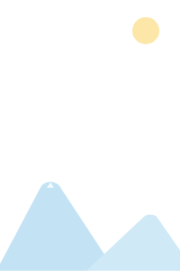 | Madroño · cielo y montañas | [SVG](assets/svg/madrono-cielo-y-montanas.svg) · [PNG](assets/png/madrono-cielo-y-montanas.png) · [@2x](assets/png/madrono-cielo-y-montanas@2x.png) · [@3x](assets/png/madrono-cielo-y-montanas@3x.png) | 200 × 308 | Logro desbloqueado, Resultado de la lección, Perfil… |
|  | Madroño · árbol y Piko | [SVG](assets/svg/madrono-arbol-y-piko.svg) · [PNG](assets/png/madrono-arbol-y-piko.png) · [@2x](assets/png/madrono-arbol-y-piko@2x.png) · [@3x](assets/png/madrono-arbol-y-piko@3x.png) | 200 × 308 | Logro desbloqueado, Resultado de la lección, Perfil… |
|  | Madroño miniatura · brote | [SVG](assets/svg/madrono-miniatura-brote.svg) · [PNG](assets/png/madrono-miniatura-brote.png) · [@2x](assets/png/madrono-miniatura-brote@2x.png) · [@3x](assets/png/madrono-miniatura-brote@3x.png) | 84 × 82 | Inicio, Mi madroño |
|  | Madroño miniatura · semilla | [SVG](assets/svg/madrono-miniatura-semilla.svg) · [PNG](assets/png/madrono-miniatura-semilla.png) · [@2x](assets/png/madrono-miniatura-semilla@2x.png) · [@3x](assets/png/madrono-miniatura-semilla@3x.png) | 76 × 68 | Mi madroño |
| 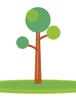 | Madroño miniatura · arbolito | [SVG](assets/svg/madrono-miniatura-arbolito.svg) · [PNG](assets/png/madrono-miniatura-arbolito.png) · [@2x](assets/png/madrono-miniatura-arbolito@2x.png) · [@3x](assets/png/madrono-miniatura-arbolito@3x.png) | 108 × 138 | Mi madroño |
| 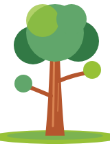 | Madroño miniatura · hojas | [SVG](assets/svg/madrono-miniatura-hojas.svg) · [PNG](assets/png/madrono-miniatura-hojas.png) · [@2x](assets/png/madrono-miniatura-hojas@2x.png) · [@3x](assets/png/madrono-miniatura-hojas@3x.png) | 160 × 216 | Mi madroño |
| 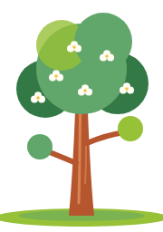 | Madroño miniatura · flores | [SVG](assets/svg/madrono-miniatura-flores.svg) · [PNG](assets/png/madrono-miniatura-flores.png) · [@2x](assets/png/madrono-miniatura-flores@2x.png) · [@3x](assets/png/madrono-miniatura-flores@3x.png) | 180 × 256 | Mi madroño |
| 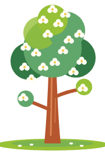 | Madroño miniatura · florecido | [SVG](assets/svg/madrono-miniatura-florecido.svg) · [PNG](assets/png/madrono-miniatura-florecido.png) · [@2x](assets/png/madrono-miniatura-florecido@2x.png) · [@3x](assets/png/madrono-miniatura-florecido@3x.png) | 180 × 262 | Mi madroño |

### Interfaz

| Vista | Nombre | Archivos | Tamaño | Dónde aparece |
|---|---|---|---|---|
|  | Parlante · escuchar | [SVG](assets/svg/parlante-escuchar.svg) · [PNG](assets/png/parlante-escuchar.png) · [@2x](assets/png/parlante-escuchar@2x.png) · [@3x](assets/png/parlante-escuchar@3x.png) | 24 × 24 | Ejercicio · Escuchar |
|  | Rayos de festejo | [SVG](assets/svg/rayos-de-festejo.svg) · [PNG](assets/png/rayos-de-festejo.png) · [@2x](assets/png/rayos-de-festejo@2x.png) · [@3x](assets/png/rayos-de-festejo@3x.png) | 100 × 100 | Logro desbloqueado |
| 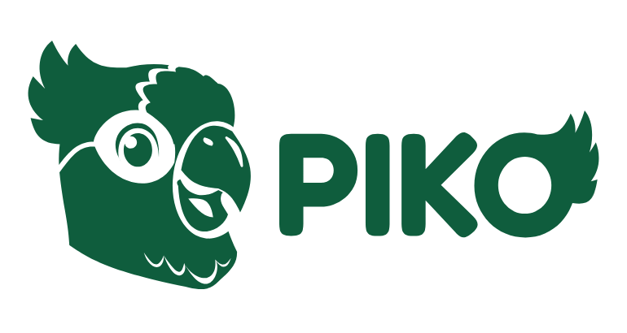 | Marca · Piko | [SVG](assets/svg/marca-piko.svg) · [PNG](assets/png/marca-piko.png) · [@2x](assets/png/marca-piko@2x.png) · [@3x](assets/png/marca-piko@3x.png) | 770 × 410 | Inicio |
|  | Candado | [SVG](assets/svg/candado.svg) · [PNG](assets/png/candado.png) · [@2x](assets/png/candado@2x.png) · [@3x](assets/png/candado@3x.png) | 30 × 30 | Mis logros |
|  | Reloj · próximamente | [SVG](assets/svg/reloj-proximamente.svg) · [PNG](assets/png/reloj-proximamente.png) · [@2x](assets/png/reloj-proximamente@2x.png) · [@3x](assets/png/reloj-proximamente@3x.png) | 30 × 30 | Mis logros |
|  | Flecha · volver | [SVG](assets/svg/flecha-volver.svg) · [PNG](assets/png/flecha-volver.png) · [@2x](assets/png/flecha-volver@2x.png) · [@3x](assets/png/flecha-volver@3x.png) | 24 × 24 | Minijuegos, La Música de Piko |

### Logros

| Vista | Nombre | Archivos | Tamaño | Dónde aparece |
|---|---|---|---|---|
|  | Insignia de logro · primera-palabra · ganada | [SVG](assets/svg/insignia-de-logro-primera-palabra-ganada.svg) · [PNG](assets/png/insignia-de-logro-primera-palabra-ganada.png) · [@2x](assets/png/insignia-de-logro-primera-palabra-ganada@2x.png) · [@3x](assets/png/insignia-de-logro-primera-palabra-ganada@3x.png) | 100 × 112 | Logro desbloqueado, Perfil, Mis logros |
|  | Insignia de logro · primer-paso · ganada | [SVG](assets/svg/insignia-de-logro-primer-paso-ganada.svg) · [PNG](assets/png/insignia-de-logro-primer-paso-ganada.png) · [@2x](assets/png/insignia-de-logro-primer-paso-ganada@2x.png) · [@3x](assets/png/insignia-de-logro-primer-paso-ganada@3x.png) | 100 × 112 | Perfil, Mis logros |
| 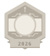 | Insignia · Piko Hackathon · bloqueada | [SVG](assets/svg/insignia-piko-hackathon-bloqueada.svg) · [PNG](assets/png/insignia-piko-hackathon-bloqueada.png) · [@2x](assets/png/insignia-piko-hackathon-bloqueada@2x.png) · [@3x](assets/png/insignia-piko-hackathon-bloqueada@3x.png) | 100 × 112 | Mis logros |
|  | Insignia · bloqueada | [SVG](assets/svg/insignia-bloqueada.svg) · [PNG](assets/png/insignia-bloqueada.png) · [@2x](assets/png/insignia-bloqueada@2x.png) · [@3x](assets/png/insignia-bloqueada@3x.png) | 100 × 112 | Mis logros |

### Minijuegos

| Vista | Nombre | Archivos | Tamaño | Dónde aparece |
|---|---|---|---|---|
| 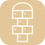 | Ícono · Rayuela | [SVG](assets/svg/icono-rayuela.svg) · [PNG](assets/png/icono-rayuela.png) · [@2x](assets/png/icono-rayuela@2x.png) · [@3x](assets/png/icono-rayuela@3x.png) | 64 × 64 | Minijuegos |
| 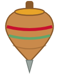 | Ícono · Trompo | [SVG](assets/svg/icono-trompo.svg) · [PNG](assets/png/icono-trompo.png) · [@2x](assets/png/icono-trompo@2x.png) · [@3x](assets/png/icono-trompo@3x.png) | 120 × 150 | Minijuegos |
| 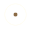 | Ícono · Chibolas | [SVG](assets/svg/icono-chibolas.svg) · [PNG](assets/png/icono-chibolas.png) · [@2x](assets/png/icono-chibolas@2x.png) · [@3x](assets/png/icono-chibolas@3x.png) | 64 × 64 | Minijuegos |
|  | Chibola · celeste | [SVG](assets/svg/chibola-celeste.svg) · [PNG](assets/png/chibola-celeste.png) · [@2x](assets/png/chibola-celeste@2x.png) · [@3x](assets/png/chibola-celeste@3x.png) | 40 × 40 | Minijuegos |
|  | Chibola · naranja | [SVG](assets/svg/chibola-naranja.svg) · [PNG](assets/png/chibola-naranja.png) · [@2x](assets/png/chibola-naranja@2x.png) · [@3x](assets/png/chibola-naranja@3x.png) | 40 × 40 | Minijuegos |
|  | Chibola · roja | [SVG](assets/svg/chibola-roja.svg) · [PNG](assets/png/chibola-roja.png) · [@2x](assets/png/chibola-roja@2x.png) · [@3x](assets/png/chibola-roja@3x.png) | 40 × 40 | Minijuegos |
|  | Chibola · verde | [SVG](assets/svg/chibola-verde.svg) · [PNG](assets/png/chibola-verde.png) · [@2x](assets/png/chibola-verde@2x.png) · [@3x](assets/png/chibola-verde@3x.png) | 40 × 40 | Minijuegos |
|  | Venda de Pikito Ciego | [SVG](assets/svg/venda-de-pikito-ciego.svg) · [PNG](assets/png/venda-de-pikito-ciego.png) · [@2x](assets/png/venda-de-pikito-ciego@2x.png) · [@3x](assets/png/venda-de-pikito-ciego@3x.png) | 178 × 292 | Minijuegos |

### Música

| Vista | Nombre | Archivos | Tamaño | Dónde aparece |
|---|---|---|---|---|
|  | Nota musical · verde | [SVG](assets/svg/nota-musical-verde.svg) · [PNG](assets/png/nota-musical-verde.png) · [@2x](assets/png/nota-musical-verde@2x.png) · [@3x](assets/png/nota-musical-verde@3x.png) | 24 × 24 | La Música de Piko |
|  | Nota musical · naranja | [SVG](assets/svg/nota-musical-naranja.svg) · [PNG](assets/png/nota-musical-naranja.png) · [@2x](assets/png/nota-musical-naranja@2x.png) · [@3x](assets/png/nota-musical-naranja@3x.png) | 24 × 24 | La Música de Piko |
|  | Instrumento · tambor | [SVG](assets/svg/instrumento-tambor.svg) · [PNG](assets/png/instrumento-tambor.png) · [@2x](assets/png/instrumento-tambor@2x.png) · [@3x](assets/png/instrumento-tambor@3x.png) | 64 × 64 | La Música de Piko |
|  | Instrumento · marimba | [SVG](assets/svg/instrumento-marimba.svg) · [PNG](assets/png/instrumento-marimba.png) · [@2x](assets/png/instrumento-marimba@2x.png) · [@3x](assets/png/instrumento-marimba@3x.png) | 64 × 64 | La Música de Piko |
| 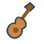 | Instrumento · guitarra | [SVG](assets/svg/instrumento-guitarra.svg) · [PNG](assets/png/instrumento-guitarra.png) · [@2x](assets/png/instrumento-guitarra@2x.png) · [@3x](assets/png/instrumento-guitarra@3x.png) | 64 × 64 | La Música de Piko |
|  | Instrumento · maracas | [SVG](assets/svg/instrumento-maracas.svg) · [PNG](assets/png/instrumento-maracas.png) · [@2x](assets/png/instrumento-maracas@2x.png) · [@3x](assets/png/instrumento-maracas@3x.png) | 64 × 64 | La Música de Piko |
| 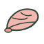 | Instrumento · concha | [SVG](assets/svg/instrumento-concha.svg) · [PNG](assets/png/instrumento-concha.png) · [@2x](assets/png/instrumento-concha@2x.png) · [@3x](assets/png/instrumento-concha@3x.png) | 64 × 64 | La Música de Piko |
| 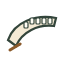 | Instrumento · quijada | [SVG](assets/svg/instrumento-quijada.svg) · [PNG](assets/png/instrumento-quijada.png) · [@2x](assets/png/instrumento-quijada@2x.png) · [@3x](assets/png/instrumento-quijada@3x.png) | 64 × 64 | La Música de Piko |

### Marca

| Vista | Archivo | Uso |
|---|---|---|
|  | [marca.svg](assets/marca/marca.svg) · [PNG](assets/marca/marca.png) · [@2x](assets/marca/marca@2x.png) · [@3x](assets/marca/marca@3x.png) | Logo en la portada y en la landing |
|  | [icono-app-1024.png](assets/marca/icono-app-1024.png) | Ícono de la app (1024 × 1024) |
| 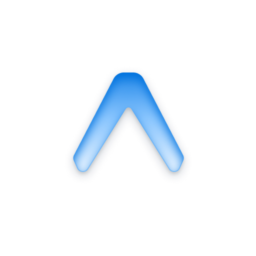 | [frente](assets/marca/android-icono-frente.png) · [fondo](assets/marca/android-icono-fondo.png) · [monocromo](assets/marca/android-icono-monocromo.png) | Ícono adaptativo de Android |
|  | [splash.png](assets/marca/splash.png) | Pantalla de arranque |
| | [piko.svg](assets/marca/piko.svg) | Piko vectorial de la landing |

## Convenciones

- Nombres en minúscula, sin tildes, con guiones: `madrono-miniatura-brote.svg`.
- Los SVG conservan su `viewBox` original; el tamaño de la tabla es el de diseño.
- Sin texto dentro de los SVG: los textos van siempre como texto, para que se puedan traducir.
- Paleta: sólo colores del manual (ver [componentes](02-sistema-de-componentes.md#color)).

---

Generado por `figma/captura/documentar.mjs` a partir de la captura del 9 de octubre de 2026. Las cifras y tablas salen de la app real; para actualizarlas, ver [figma/README.md](../../figma/README.md).
